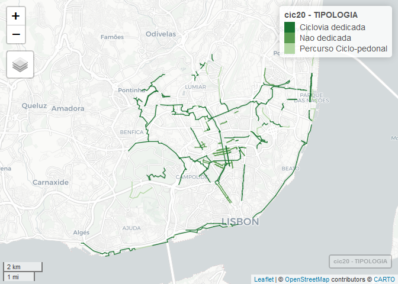

## Importação dos dados
#### Importar packages R

```r
library(tidyverse)
library(sf)
library(mapview)
library(units)
library(cartography)
```

#### Importar rede ciclável
Download da informação geoffererenciada a partir do servidor da CML: http://geodados.cm-lisboa.pt/datasets/440b7424a6284e0b9bf11179b95bf8d1_0

```r
CicloviasATUAL = st_read("https://opendata.arcgis.com/datasets/440b7424a6284e0b9bf11179b95bf8d1_0.geojson") 
```

```r
length(unique(CicloviasATUAL$OBJECTID)) #701
length(unique(CicloviasATUAL$COD_SIG_TR)) #672
```


Adicionar campo de `ID único`, _enquanto a BD oficial não tiver um_.

```r
CicloviasCORRECT = CicloviasATUAL[,c(2,4,7,19,28)]

CicloviasCORRECT$IDunico = paste(CicloviasCORRECT$COD_SIG_TR, round(CicloviasCORRECT$Shape__Length), sep = "_" )
CicloviasCORRECT = CicloviasCORRECT[,c(7,2:4)]
table(duplicated(CicloviasCORRECT$IDunico)) #0
```
Agora temos um campo único para cada segmento.


## Corrigir dados
#### Remover os que estão a mais

```r
#Remover os que estão a mais
CicloviasCORRECT = CicloviasCORRECT[!(CicloviasCORRECT$IDunico %in% c("157090_170","157090_248","157090_101","157090_93")),] #av ribeira das naus
CicloviasCORRECT = CicloviasCORRECT[!(CicloviasCORRECT$IDunico %in% c("A000006_1650","B0000282_137")),] #campo grande em toda a extenção > ver se é preciso também o "A000006_76"
CicloviasCORRECT = CicloviasCORRECT[!(CicloviasCORRECT$IDunico %in% c("B0000023_1372")),]
#telheiras dividir segmento que apareceu em anos diferentes
CicloviasCORRECT = CicloviasCORRECT[!(CicloviasCORRECT$IDunico %in% c("7349_96","7306_37")),] #travessa das recolhidas
CicloviasCORRECT = CicloviasCORRECT[!(CicloviasCORRECT$IDunico == "B0000396_2741"),] #braço de prata foi dividido em dois
CicloviasCORRECT = CicloviasCORRECT[!(CicloviasCORRECT$IDunico %in% c("1260_49","1276_49","1287_48","1301_36" )),]  #rio zezere
```
#### Adicionar segmentos que foram entretanto destruídos, a partir de uma shapefile antiga

```r
ADICIONAR = st_read("data/Adicionar.shp")
ADICIONAR = st_transform(ADICIONAR, st_crs(CicloviasCORRECT))
ADICIONAR$IDunico = as.character(as.integer(rownames(ADICIONAR))+4000)
CicloviasA = as.data.frame(CicloviasCORRECT)
ADICIONARA = as.data.frame(ADICIONAR[,-c(1)])
CicloviasCORRECT = rbind(CicloviasA, ADICIONARA)
CicloviasCORRECT = st_sf(CicloviasCORRECT, sf_column_name="geometry", crs = 4326)
rm(ADICIONAR,ADICIONARA,CicloviasA)
```


#### Acertar anos de construção

```r
CicloviasCORRECT$ANO = as.integer(as.character(CicloviasCORRECT$ANO))

ano2001 = c("B0000371_346")
ano2003 = c("6708_2658")
ano2005 = c("B0000204_1518","B0000080_2058","B0000205_350")
ano2008 = c("B0000025_90","B0000173_248","B0000085_140")
ano2009 = c("B0000224_358","A000002_536","B0000015_1191","B0000012_814","B0000138_705","B0000144_805",
            "B0000237_302","B0000145_188","B0000225_513","B0000132_975","B0000205_1090",
            "B0000174_231","B0000024_393","B0000210_237","B0000081_129",
            "B0000028_905","B0000010_907","B0000011_234","B0000214_500","B0000013_206","B0000212_96",
            "A000008_1278","B0000216_487","B0000009_159","B0000202_21","B0000184_575","A000007_758")
ano2010 = c("B0000036_446","B0000026_174","14296_338","A000019_853","152515_106","B0000006_197","12211_98",
            "3185_44","152515_35","23242_36","B0000285_20","159396_215","B0000284_14","159396_55",
            "159399_24","B0000041_135","19676_120","12210_60","14286_112","A000016_315","B0000061_234",
            "B0000064_28","B0000065_26","B0000066_40","B0000063_50","B0000062_177","6244_119","6244_83",
            "A000017_372")
ano2011 = c("B0000017_336","B0000018_296","B0000018_193","B0000147_435","B0000146_12","B0000181_440")
ano2012 = c("B0000266_43","B0000265_82","B0000028_905","B0000188_512","B0000037_966","B0000078_142")
ano2013 = c("18320_426","159178_211","159044_12","158526_223","159033_430","159043_221","159023_7",
            "159031_608","159021_268","159179_12","159022_11")
ano2014 = c("B0000045_722","B0000140_43","15102_41","2607_65","14168_57","B0000367_401")
ano2015 = c("5777_373","5684_84","B0000215_22","5593_48","B0000243_41", "B0000057_287", "B0000038_533", "B0000183_184", "B0000240_458")
ano2016 = c("18155_126","17340_64","158357_62","18153_140","17343_181","18029_76","B0000077_31","18031_81")
ano2018 = c("B0000373_662")
ano2019 = c("B0000372_1133","B0000392_343","B0000391_377","4198_173","15403_90","153668_146","4128_191",
            "4671_198","156600_67","4614_226","4198_159","B0000325_61","B0000325_111","15403_3","15620_190",
            "B0000393_944","B0000390_948")

CicloviasCORRECT$ANO[CicloviasCORRECT$IDunico %in% ano2001] = 2001
CicloviasCORRECT$ANO[CicloviasCORRECT$IDunico %in% ano2003] = 2003
CicloviasCORRECT$ANO[CicloviasCORRECT$IDunico %in% ano2005] = 2005
CicloviasCORRECT$ANO[CicloviasCORRECT$IDunico %in% ano2008] = 2008
CicloviasCORRECT$ANO[CicloviasCORRECT$IDunico %in% ano2009] = 2009
CicloviasCORRECT$ANO[CicloviasCORRECT$IDunico %in% ano2010] = 2010
CicloviasCORRECT$ANO[CicloviasCORRECT$IDunico %in% ano2011] = 2011
CicloviasCORRECT$ANO[CicloviasCORRECT$IDunico %in% ano2012] = 2012
CicloviasCORRECT$ANO[CicloviasCORRECT$IDunico %in% ano2013] = 2013
CicloviasCORRECT$ANO[CicloviasCORRECT$IDunico %in% ano2014] = 2014
CicloviasCORRECT$ANO[CicloviasCORRECT$IDunico %in% ano2015] = 2015
CicloviasCORRECT$ANO[CicloviasCORRECT$IDunico %in% ano2016] = 2016
CicloviasCORRECT$ANO[CicloviasCORRECT$IDunico %in% ano2018] = 2018
CicloviasCORRECT$ANO[CicloviasCORRECT$IDunico %in% ano2019] = 2019
```

#### Reclassificar ciclovias
Em __dedicadas__ (uni e bi-direccionais, pistas cicláveis) e __não-dedicadas__ (30+bici, zona de coexistência), e __percursos em coexistência com o peão__ (ciclo-pedonal)

```r
CicloviasCORRECT$TIPOLOGIA = as.character(CicloviasCORRECT$TIPOLOGIA)
table(CicloviasCORRECT$TIPOLOGIA)
CicloviasCORRECT$TIPOLOGIA[CicloviasCORRECT$TIPOLOGIA=="Ciclovia segregada"] = "Ciclovia dedicada"
CicloviasCORRECT$TIPOLOGIA[CicloviasCORRECT$TIPOLOGIA=="Faixas Cicláveis ou Contrafluxos"] = "Ciclovia dedicada"
CicloviasCORRECT$TIPOLOGIA[CicloviasCORRECT$TIPOLOGIA=="Faixa Ciclavel"] = "Ciclovia dedicada"
CicloviasCORRECT$TIPOLOGIA[CicloviasCORRECT$TIPOLOGIA=="Pista Ciclável Bidirecional"] = "Ciclovia dedicada"
CicloviasCORRECT$TIPOLOGIA[CicloviasCORRECT$TIPOLOGIA=="Pista Ciclavel Bidirecional"] = "Ciclovia dedicada"
CicloviasCORRECT$TIPOLOGIA[CicloviasCORRECT$TIPOLOGIA=="Pistas Cicláveis Unidirecionais"] = "Ciclovia dedicada"
CicloviasCORRECT$TIPOLOGIA[CicloviasCORRECT$TIPOLOGIA=="Ponte"] = "Ciclovia dedicada" #tirar o ponte ciclo-pedonal
CicloviasCORRECT$TIPOLOGIA[CicloviasCORRECT$TIPOLOGIA=="Zona de Coexistência"] = "Nao dedicada"
CicloviasCORRECT$TIPOLOGIA[CicloviasCORRECT$TIPOLOGIA=="Zona de Coexistencia"] = "Nao dedicada"
CicloviasCORRECT$TIPOLOGIA[CicloviasCORRECT$TIPOLOGIA=="Bus+Bici"] = "Nao dedicada"
CicloviasCORRECT$TIPOLOGIA[CicloviasCORRECT$TIPOLOGIA=="30+Bici"] = "Nao dedicada"

pontes = c("B0000021_145","B0000022_122","B0000002_128","B0000178_113","B0000034_371","B0000312_174",
           "B0000259_45","B0000260_37","B0000261_374","B0000262_116","B0000263_335","B0000264_73",
           "B0000265_82","B0000266_43","B0000267_172","B0000268_254","B0000269_257","B0000270_221",
           "B0000272_201","B0000273_20","B0000274_117","B0000275_88","B0000276_236","B0000277_27",
           "B0000215_22","B0000278_214","B0000279_263","B0000280_328","B0000281_63","B0000139_313")
CicloviasCORRECT$TIPOLOGIA[CicloviasCORRECT$IDunico %in% pontes] = "Ciclovia dedicada"


#Casos particulares
CicloviasCORRECT$TIPOLOGIA[CicloviasCORRECT$IDunico %in% c("4016","4017")] = "Percurso Ciclo-pedonal" #Alameda keil do Amaral
# CicloviasCORRECT$TIPOLOGIA[CicloviasCORRECT$IDunico=="B0000205_1090"] = "Nao dedicada" #troço em frente ao museu da elecricidade - deixar como ciclo-pedonal?

#tirar o trilho
CicloviasCORRECT = CicloviasCORRECT[CicloviasCORRECT$TIPOLOGIA!="Trilho",]

#tirar o "Percurso Ciclo-pedonal"?
table(CicloviasCORRECT$TIPOLOGIA)
```

#### Acertar nomes

```r
#Nomes
CicloviasCORRECT$DESIGNACAO = as.character(CicloviasCORRECT$DESIGNACAO)
CicloviasCORRECT$DESIGNACAO[CicloviasCORRECT$DESIGNACAO=="---- Campo Grande"] = "Campo Grande"
CicloviasCORRECT$DESIGNACAO[CicloviasCORRECT$DESIGNACAO=="---- Eixo Central"] = "Alta de Lisboa"
```


##### Acertar geometria

```r
#renomear
Ciclovias = CicloviasCORRECT
Ciclovias$TIPOLOGIA = factor(Ciclovias$TIPOLOGIA)

#recalcular geometria
Ciclovias$lenght = st_length(Ciclovias) %>% units::set_units(km)
sum(Ciclovias$lenght)
# calma, há segmentos que foram destruídos entretanto
```

### Ver num mapa
Todas as ciclovias que existem ou existiram

```r
mapview::mapview(Ciclovias, zcol="TIPOLOGIA", lwd=1.5, hide=T, legend=T)
```


### Criar tabelas para cada ano
Que inclui as que existiam no ano anterior

```r
Ciclovias$AnoT = Ciclovias$ANO

Cic <- lapply(2001:2020, function(i) {
  subset(Ciclovias, AnoT == i)
})
Ciclovias2020T=Ciclovias[-c(1:nrow(Ciclovias)),] #para ter exaxtamente os mesmos campos que o Ciclovias

for (i in 1:length(Cic)){
  Ciclovias_ano <- Ciclovias[-c(1:nrow(Ciclovias)),] #idem
  for (j in 1:i){
    Ciclovias_ano <- rbind(Ciclovias_ano, Cic[[j]])
    Ciclovias_ano$AnoT <- j+2000
  }
    Ciclovias2020T <- rbind(Ciclovias2020T, Ciclovias_ano)
}
```

Remover as ciclovias que foram destruídas

```r
#remover corte do campo grande: construção do estádio Alvalade em 2003/2004
Ciclovias2020T =Ciclovias2020T[!(Ciclovias2020T$IDunico==4015 & Ciclovias2020T$AnoT>=2003),]
Ciclovias2020T =Ciclovias2020T[!(Ciclovias2020T$IDunico==4014 & Ciclovias2020T$AnoT>=2003),]
#substituiçao do bici+BUS da avenida da liberdade pelas laterais
Ciclovias2020T =Ciclovias2020T[!(Ciclovias2020T$IDunico==4010 & Ciclovias2020T$AnoT>=2013),]
#Desaparece o encerramento da Av Ribeira das Naus ao transito
Ciclovias2020T =Ciclovias2020T[!(Ciclovias2020T$IDunico=="157090_170" & Ciclovias2020T$AnoT>=2014),]
Ciclovias2020T =Ciclovias2020T[!(Ciclovias2020T$IDunico=="157090_248" & Ciclovias2020T$AnoT>=2014),]
Ciclovias2020T =Ciclovias2020T[!(Ciclovias2020T$IDunico=="157090_101" & Ciclovias2020T$AnoT>=2014),]
Ciclovias2020T =Ciclovias2020T[!(Ciclovias2020T$IDunico=="157090_93" & Ciclovias2020T$AnoT>=2014),]
#É reformulada a do Campo Grande e desaparece um troço
Ciclovias2020T =Ciclovias2020T[!(Ciclovias2020T$IDunico==4011 & Ciclovias2020T$AnoT>=2017),]
#desaparece a zona coexist junto ao rio no braço de prata, e é criada uma ciclovia
Ciclovias2020T =Ciclovias2020T[!(Ciclovias2020T$IDunico==4006 & Ciclovias2020T$AnoT>=2017),]
#é reformulada uma ciclovia na estrada da pontinha
```

Confirmar mapa actual

```r
cic20=Ciclovias2020T[Ciclovias2020T$AnoT==2020,]
greens3 = cartography::carto.pal(pal1 = "green.pal", 3)
greens3 = rev(greens3)
mapview(cic20, zcol="TIPOLOGIA", color = greens3, lwd=1.5, hide=T, legend=T)
```


### Adicionar contador de km

```r
#Adicionar campo com extensão da rede acumulada
CicloviasKM = Ciclovias2020T[,c(3,5,6)]
st_geometry(CicloviasKM) = NULL
CicloviasKMnull = data.frame(TIPOLOGIA= c("Nao dedicada", "Nao dedicada"),
                             lenght=0, AnoT = c(2001,2002),stringsAsFactors=FALSE)
CicloviasKMnull$lenght = CicloviasKMnull$lenght %>% units::set_units(km)
CicloviasKM = rbind(CicloviasKM,CicloviasKMnull)

CicloviasKM = CicloviasKM  %>% group_by(AnoT, TIPOLOGIA) %>% summarise_at(1, sum, na.rm=TRUE)

CicloviasKM$Kms <- paste(round(CicloviasKM$lenght,digits = 0),"km", sep=" ")
```

### Agrupar features
Porque senão ficava muito lento

```r
CicloviasAnos = Ciclovias2020T %>% 
  group_by(DESIGNACAO,TIPOLOGIA,AnoT,ANO) %>% summarise() %>% ungroup()

CicloviasAnos$lenght = st_length(CicloviasAnos) %>% units::set_units(km)
sum(CicloviasAnos$lenght[CicloviasAnos$AnoT==2020]) #extensão da rede actual
```

## Guardar ficheiros
Na pasta da app

```r
saveRDS(CicloviasAnos, "app_path/CicloviasAnos.Rds")
saveRDS(CicloviasKM, "app_path/CicloviasKM.Rds")
```
