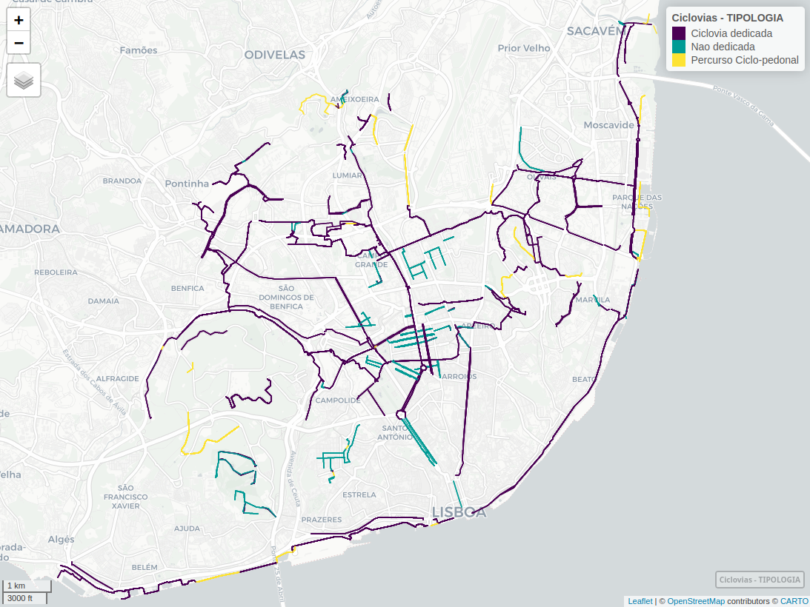
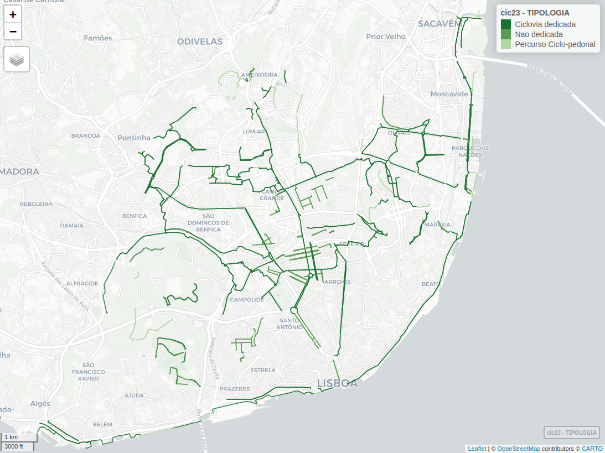

```{r setup, include=FALSE}
knitr::opts_chunk$set(echo = TRUE)
library(rmarkdown)
```

## Importação dos dados
#### Importar packages R
```{r eval=FALSE}
library(tidyverse)
library(sf)
library(mapview)
library(units)
library(cartography)
```

#### Importar rede ciclável
Download da informação geoffererenciada a partir do servidor da CML: 
https://services.arcgis.com/1dSrzEWVQn5kHHyK/arcgis/rest/services/Ciclovias/FeatureServer/0/query?outFields=*&where=1%3D1&f=geojson

```{r eval=FALSE}
CicloviasAnteriores = readRDS("CicloviasAnos/CicloviasAnos.Rds")
Ciclovias2023 = st_read("https://services.arcgis.com/1dSrzEWVQn5kHHyK/arcgis/rest/services/Ciclovias/FeatureServer/0/query?outFields=*&where=1%3D1&f=geojson")
```
```{r eval=FALSE}
length(unique(Ciclovias2023$OBJECTID)) #892
length(unique(Ciclovias2023$COD_SIG)) #864
```


Adicionar campo de `ID único`, _enquanto a BD oficial não tiver um_.

```{r eval=FALSE}
# ver primeiro as que já tínhamos


```


```{r eval=FALSE}
Ciclovias2023 = Ciclovias2023 |> select(COD_SIG, DESIGNACAO, TIPOLOGIA, NIVEL_SEGREGACAO, ANO, Shape__Length, geometry)

Ciclovias2023$IDunico = paste(Ciclovias2023$COD_SIG, round(Ciclovias2023$Shape__Length), sep = "_" )
Ciclovias2023 = Ciclovias2023[,c(7,2:5)]
table(duplicated(Ciclovias2023$IDunico)) #0
```
Agora temos um campo único para cada segmento.


## Corrigir dados
Adicionar as novas que não estavam na shp anterior de Dez 2022.

#### Remover os que estão a mais
```{r eval=FALSE}
#filtrar só últimos anos
Ciclovias2023 = Ciclovias2023 %>% filter(ANO == 2023)

#exportar e abrir no sig
st_write(Ciclovias2023, "data/Ciclovias2023_dez_cml.gpkg", delete_dsn = TRUE)

#prolongar vida ultimos anos
CicloviasAnteriores_23 = CicloviasAnteriores %>% filter(AnoT == 2022) %>% mutate(AnoT = 2023)
CicloviasAnteriores = rbind(CicloviasAnteriores, CicloviasAnteriores_23)
```


#### Importar novamente o shp atualizado

Neste caso removeu-se um troço de ciclovia na Rua Francisco Gentil Martins (que já existia anteriormente), e adicionou-se o troço da Rua da Prata.
Atualizou-se a ciclovia da Av Berna / Praça de Espanha, que passou a ter nova configuração.

```{r}
Ciclovias2023_new = st_read("data/Ciclovias2023_dez_corrigido.gpkg")
AvBerna23 = st_read("data/avberna_2023.gpkg", layer = "avberna_2023")
Ciclovias2023_new = rbind(Ciclovias2023_new|> select(-NIVEL_SEGREGACAO), AvBerna23 |> select(-AnoT, -lenght))
# Rua da Prata em dúvida quanto à sua categoria
Ciclovias2023_new$TIPOLOGIA[Ciclovias2023_new$DESIGNACAO=="Rua da Prata"] = "Nao dedicada"
# por acgora fica equivalente a uma bici+30, e não um percurso ciclopedonal (tipo trilho)
```

#### Reclassificar ciclovias
Em __dedicadas__ (uni e bi-direccionais, pistas cicláveis) e __não-dedicadas__ (30+bici, zona de coexistência), e __percursos em coexistência com o peão__ (ciclo-pedonal)
```{r eval=FALSE}
table(Ciclovias2023_new$TIPOLOGIA)
Ciclovias2023_new$TIPOLOGIA[Ciclovias2023_new$TIPOLOGIA=="Percurso Ciclopedonal"] = "Percurso Ciclo-pedonal"
Ciclovias2023_new$TIPOLOGIA[Ciclovias2023_new$TIPOLOGIA=="Pista Ciclavel Bidirecional"] = "Ciclovia dedicada"
Ciclovias2023_new$TIPOLOGIA[Ciclovias2023_new$TIPOLOGIA=="Pista Ciclável Bidirecional"] = "Ciclovia dedicada"
Ciclovias2023_new$TIPOLOGIA[Ciclovias2023_new$TIPOLOGIA=="Pista Ciclável Unidirecional"] = "Ciclovia dedicada"
Ciclovias2023_new$TIPOLOGIA[Ciclovias2023_new$TIPOLOGIA=="Pista ciclável (ciclovia)"] = "Ciclovia dedicada"
Ciclovias2023_new$TIPOLOGIA[Ciclovias2023_new$TIPOLOGIA=="Contrassentido"] = "Ciclovia dedicada"
Ciclovias2023_new$TIPOLOGIA[Ciclovias2023_new$TIPOLOGIA=="Faixa Ciclável"] = "Ciclovia dedicada"

Ciclovias2023_new$TIPOLOGIA[Ciclovias2023_new$TIPOLOGIA=="30+Bici"] = "Nao dedicada"
Ciclovias2023_new$TIPOLOGIA[Ciclovias2023_new$TIPOLOGIA=="Zona de Coexistência"] = "Nao dedicada"
```

#### Juntar novamente com as anteriores
```{r eval=FALSE}
# preparar tabela
Ciclovias2023_new = Ciclovias2023_new |> select(DESIGNACAO, TIPOLOGIA, geom) |> 
  mutate(ANO = 2023, AnoT = 2023, lenght = st_length(geom) %>% units::set_units(km))
# # rename sf column
# st_geometry(Ciclovias2023_new) = "geom"

#factor tipologia
Ciclovias2023_new$TIPOLOGIA = factor(Ciclovias2023_new$TIPOLOGIA)

#juntar
Ciclovias = bind_rows(CicloviasAnteriores, Ciclovias2023_new)

#recalcular geometria
# Ciclovias$lenght = st_length(Ciclovias) %>% units::set_units(km)
sum(Ciclovias$lenght)
# calma, há segmentos que foram destruídos entretanto
```

### Ver num mapa
Todas as ciclovias que existem ou existiram no server da CML
```{r eval=FALSE}
mapview::mapview(Ciclovias, zcol="TIPOLOGIA", lwd=1.5, hide=T, legend=T)
```

### Remover ciclovias que desapareceram entretanto
```{r eval=FALSE}
# remover anterior Av Berna em 2023
Ciclovias = Ciclovias %>% filter(!(DESIGNACAO == "Avenida de Berna" & AnoT == 2023)) # Av berna todas
Ciclovias = Ciclovias %>% filter(!(DESIGNACAO == "Praça Espanha" & AnoT == 2023 & ANO == 2021)) # Pç espanha ligacao
#as novas configurações da Pc Espanha já vinham no ficheiro avberna_2023
```

### Confirmar mapa actual
```{r eval=FALSE}
cic23=Ciclovias[Ciclovias$AnoT==2023,]
# greens3 = cartography::carto.pal(pal1 = "green.pal", 3)
# greens3 = rev(greens3)
greens3 = c("#197230", "#5A9C50", "#B2D6A3")
mapview(cic23, zcol="TIPOLOGIA", color = greens3, lwd=1.5, hide=T, legend=T)
```


### Adicionar contador de km
```{r eval=FALSE}
#Adicionar campo com extensão da rede acumulada
CicloviasKM = Ciclovias %>% select(AnoT, lenght, TIPOLOGIA) %>% st_drop_geometry()

CicloviasKMnull = data.frame(TIPOLOGIA= c("Nao dedicada", "Nao dedicada"),
                             lenght=0, AnoT = c(2001,2002),stringsAsFactors=FALSE)
CicloviasKMnull$lenght = CicloviasKMnull$lenght %>% units::set_units(km)
CicloviasKM = rbind(CicloviasKM,CicloviasKMnull)

CicloviasKM = CicloviasKM  %>% group_by(AnoT, TIPOLOGIA) %>% summarise(lenght = sum(lenght, na.rm=TRUE)) %>% ungroup()

CicloviasKM$Kms <- paste(round(CicloviasKM$lenght,digits = 0),"km", sep=" ")
```

### Agrupar features
Porque senão ficava muito lento
```{r eval=FALSE}
CicloviasAnos = Ciclovias %>% 
  group_by(DESIGNACAO,TIPOLOGIA,AnoT,ANO) %>% summarise() %>% ungroup()

CicloviasAnos$lenght = st_length(CicloviasAnos) %>% units::set_units(km)
sum(CicloviasAnos$lenght[CicloviasAnos$AnoT==2023]) #extensão da rede actual
```

## Guardar ficheiros
Na pasta da app
```{r eval=FALSE}
saveRDS(CicloviasAnos, "CicloviasAnos/CicloviasAnos.Rds")
saveRDS(CicloviasKM, "CicloviasAnos/CicloviasKM.Rds")
```

```{r}
st_write(Ciclovias, "data/Ciclovias_dez2023_CORRECT.gpkg", delete_dsn = TRUE)
```

