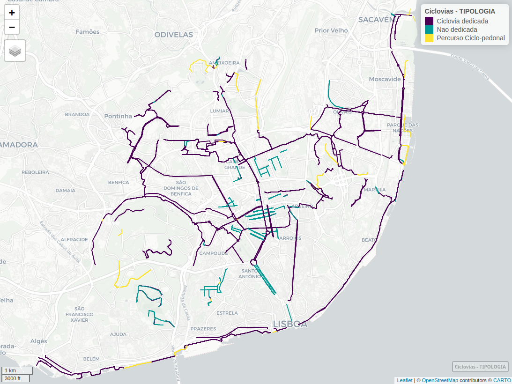

```{r setup, include=FALSE}
knitr::opts_chunk$set(echo = TRUE)
library(rmarkdown)
```

## Importação dos dados
#### Importar packages R
```{r eval=FALSE}
library(tidyverse)
library(sf)
library(mapview)
library(units)
library(cartography)
```

#### Importar rede ciclável
Download da informação geoffererenciada a partir do servidor da CML: 
https://services.arcgis.com/1dSrzEWVQn5kHHyK/arcgis/rest/services/Ciclovias/FeatureServer/0/query?outFields=*&where=1%3D1&f=geojson

```{r eval=FALSE}
CicloviasAnteriores = readRDS("CicloviasAnos/CicloviasAnos.Rds")
Ciclovias2024 = st_read("https://services.arcgis.com/1dSrzEWVQn5kHHyK/arcgis/rest/services/Ciclovias/FeatureServer/0/query?outFields=*&where=1%3D1&f=geojson")
```
```{r eval=FALSE}
length(unique(Ciclovias2024$OBJECTID)) #894
length(unique(Ciclovias2024$COD_SIG)) #866
```


## Corrigir dados

Adicionar as novas que não estavam na shp anterior de Dez 2023.

#### Remover os que estão a mais

```{r eval=FALSE}
#filtrar só últimos anos
Ciclovias2024 = Ciclovias2024 %>% filter(ANO %in% c("2023", "2024"))
# atenção que há umas que vêm da CML que não têm ano atribuído!

#exportar e abrir no sig
st_write(Ciclovias2024, "data/Ciclovias2024_dez_cml.gpkg", delete_dsn = TRUE)
```

### Verificar as que não têm ano

```{r}
Ciclovias2024_semdata = st_read("https://services.arcgis.com/1dSrzEWVQn5kHHyK/arcgis/rest/services/Ciclovias/FeatureServer/0/query?outFields=*&where=1%3D1&f=geojson")
Ciclovias2024_semdata = Ciclovias2024_semdata |> filter(ANO == "Sem dados")

#exportar e abrir no sig
st_write(Ciclovias2024_semdata, "data/Ciclovias2024_semdata_dez_cml.gpkg", delete_dsn = TRUE)
mapview(Ciclovias2024_semdata)
```


#### Importar novamente o shp atualizado

```{r eval=FALSE}
Ciclovias2024_new = st_read("data/Ciclovias2023-24_pre.gpkg")
Ciclovias2024_new = Ciclovias2024_new |> filter(is.na(AnoT)) |> filter(ANO == "2024")
```

Neste caso adicionou-se:
*  Rua Alexandre Ferreira
*  Estrada do Desvio (segunda parte)
*  Passeio de Neptuno (segunda parte)
*  Sete Rios
*  Parada Alto de São João
*  Largo de São Sebastião


#### Incluir as anteriores que não tinham data ou não estavam no da CML

*  Eixo Central da Alta de Lisboa (segunda parte)

```{r eval=FALSE}
Ciclovias2024_outrasanteriores = st_read("data/Ciclovias2023-24_pre.gpkg")
Ciclovias2024_outrasanteriores = Ciclovias2024_outrasanteriores |> filter(is.na(AnoT)) |> filter(ANO == "2023")
# duplicar para os anos seguintes
# 
# # 2.   Estrada do Barcal (desde 2023)
# Ciclovias2024_outrasanteriores_1_23 = Ciclovias2024_outrasanteriores %>% filter(DESIGNACAO == "Alta de Lisboa") |> mutate(AnoT = 2023)
# Ciclovias2024_outrasanteriores_1_24 = Ciclovias2024_outrasanteriores %>% filter(DESIGNACAO == "Alta de Lisboa") |> mutate(AnoT = 2024)
# Ciclovias2024_outrasanteriores = rbind(
#   Ciclovias2024_outrasanteriores,
#   Ciclovias2024_outrasanteriores_1_23,
#   Ciclovias2024_outrasanteriores_1_24
# )

# limpar
rm(Ciclovias2024_outrasanteriores_1_23, Ciclovias2024_outrasanteriores_1_24)

```

```{r, eval=FALSE}
# Juntar 2024 novamente
Ciclovias2024_new = Ciclovias2024_new |> select(DESIGNACAO, TIPOLOGIA, geom) |> 
  mutate(ANO = 2024, AnoT = 2024, lenght = st_length(geom) %>% units::set_units(km))
# # rename sf column
# st_geometry(Ciclovias2024_new) = "geom"

Ciclovias2024_outrasanteriores = Ciclovias2024_outrasanteriores |> 
  filter(!is.na(AnoT)) |>
  mutate(lenght = st_length(geom) %>% units::set_units(km))

Ciclovias2024_new = rbind(Ciclovias2024_new, Ciclovias2024_outrasanteriores)
```

#### Reclassificar ciclovias
Em __dedicadas__ (uni e bi-direccionais, pistas cicláveis) e __não-dedicadas__ (30+bici, zona de coexistência), e __percursos em coexistência com o peão__ (ciclo-pedonal)
```{r eval=FALSE}
table(Ciclovias2024_new$TIPOLOGIA)
Ciclovias2024_new$TIPOLOGIA[Ciclovias2024_new$TIPOLOGIA=="Percurso Ciclopedonal"] = "Percurso Ciclo-pedonal"
Ciclovias2024_new$TIPOLOGIA[Ciclovias2024_new$TIPOLOGIA=="Pista Ciclavel Bidirecional"] = "Ciclovia dedicada"
Ciclovias2024_new$TIPOLOGIA[Ciclovias2024_new$TIPOLOGIA=="Pista Ciclável Bidirecional"] = "Ciclovia dedicada"
Ciclovias2024_new$TIPOLOGIA[Ciclovias2024_new$TIPOLOGIA=="Pista Ciclável Unidirecional"] = "Ciclovia dedicada"
Ciclovias2024_new$TIPOLOGIA[Ciclovias2024_new$TIPOLOGIA=="Pista ciclável (ciclovia)"] = "Ciclovia dedicada"
Ciclovias2024_new$TIPOLOGIA[Ciclovias2024_new$TIPOLOGIA=="Contrassentido"] = "Ciclovia dedicada"
Ciclovias2024_new$TIPOLOGIA[Ciclovias2024_new$TIPOLOGIA=="Faixa Ciclável"] = "Ciclovia dedicada"

Ciclovias2024_new$TIPOLOGIA[Ciclovias2024_new$TIPOLOGIA=="30+Bici"] = "Nao dedicada"
Ciclovias2024_new$TIPOLOGIA[Ciclovias2024_new$TIPOLOGIA=="Zona de Coexistência"] = "Nao dedicada"

#factor tipologia
Ciclovias2024_new$TIPOLOGIA = factor(Ciclovias2024_new$TIPOLOGIA)
```

#### Juntar novamente com as anteriores
```{r eval=FALSE}
#prolongar vida ultimos anos
CicloviasAnteriores_24 = CicloviasAnteriores %>% filter(AnoT == 2023) %>% mutate(AnoT = 2024)
CicloviasAnteriores = rbind(CicloviasAnteriores, CicloviasAnteriores_24)

#juntar
Ciclovias = bind_rows(CicloviasAnteriores, Ciclovias2024_new)

#remover duplicados
Ciclovias = distinct(Ciclovias)


#recalcular geometria
# Ciclovias$lenght = st_length(Ciclovias) %>% units::set_units(km)
sum(Ciclovias$lenght)
# calma, há segmentos que foram destruídos entretanto
```

### Ver num mapa
Todas as ciclovias que existem ou existiram no server da CML
```{r eval=FALSE}
mapview::mapview(Ciclovias, zcol="TIPOLOGIA", lwd=1.5, hide=F, legend=T)
```

### Remover ciclovias que desapareceram entretanto


Atualizou-se a ciclovia do Passeio de Neptuno e da Praça de Espanha, que passou a ter nova configuração.


```{r eval=FALSE}
# remover anterior Av Berna em 2024
Ciclovias = Ciclovias %>% filter(!(DESIGNACAO == "Avenida de Berna" & AnoT == 2024)) # Av berna todas
Ciclovias = Ciclovias %>% filter(!(DESIGNACAO == "Praça Espanha" & AnoT == 2024 & ANO == 2021)) # Pç espanha ligacao
#as novas configurações da Pc Espanha já vinham no ficheiro avberna_2024
```

### Confirmar mapa actual
```{r eval=FALSE}
cic24=Ciclovias[Ciclovias$AnoT==2024,]
# greens3 = cartography::carto.pal(pal1 = "green.pal", 3)
# greens3 = rev(greens3)
greens3 = c("#197230", "#5A9C50", "#B2D6A3")
mapview(cic24, zcol="TIPOLOGIA", color = greens3, lwd=1.5, hide=F, legend=T)
```


### Adicionar contador de km
```{r eval=FALSE}
#Adicionar campo com extensão da rede acumulada
CicloviasKM = Ciclovias %>% select(AnoT, lenght, TIPOLOGIA) %>% st_drop_geometry()

CicloviasKMnull = data.frame(TIPOLOGIA= c("Nao dedicada", "Nao dedicada"),
                             lenght=0, AnoT = c(2001,2002),stringsAsFactors=FALSE)
CicloviasKMnull$lenght = CicloviasKMnull$lenght %>% units::set_units(km)
CicloviasKM = rbind(CicloviasKM,CicloviasKMnull)

CicloviasKM = CicloviasKM  %>% group_by(AnoT, TIPOLOGIA) %>% summarise(lenght = sum(lenght, na.rm=TRUE)) %>% ungroup()

CicloviasKM$Kms <- paste(round(CicloviasKM$lenght,digits = 0),"km", sep=" ")
```

### Agrupar features
Porque senão ficava muito lento
```{r eval=FALSE}
CicloviasAnos = Ciclovias %>% 
  group_by(DESIGNACAO,TIPOLOGIA,AnoT,ANO) %>% summarise() %>% ungroup()

CicloviasAnos$lenght = st_length(CicloviasAnos) %>% units::set_units(km)
sum(CicloviasAnos$lenght[CicloviasAnos$AnoT==2024]) #extensão da rede actual
```

## Guardar ficheiros
Na pasta da app
```{r eval=FALSE}
saveRDS(CicloviasAnos, "CicloviasAnos/CicloviasAnos.Rds")
saveRDS(CicloviasKM, "CicloviasAnos/CicloviasKM.Rds")
```

```{r}
st_write(Ciclovias, "data/Ciclovias_dez2024_CORRECT.gpkg", delete_dsn = TRUE)
```

