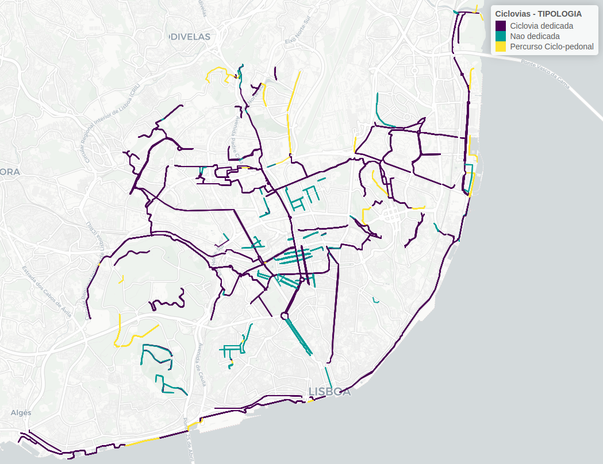

```{r setup, include=FALSE}
knitr::opts_chunk$set(echo = TRUE)
library(rmarkdown)
```

## Importação dos dados
#### Importar packages R
```{r eval=FALSE}
library(tidyverse)
library(sf)
library(mapview)
library(units)
library(cartography)
```

#### Importar rede ciclável
Download da informação geoffererenciada a partir do servidor da CML: 
https://services.arcgis.com/1dSrzEWVQn5kHHyK/arcgis/rest/services/Ciclovias/FeatureServer/0/query?outFields=*&where=1%3D1&f=geojson

```{r eval=FALSE}
CicloviasAnteriores = readRDS("CicloviasAnos/CicloviasAnos.Rds")
Ciclovias2024 = st_read("https://services.arcgis.com/1dSrzEWVQn5kHHyK/arcgis/rest/services/Ciclovias/FeatureServer/0/query?outFields=*&where=1%3D1&f=geojson")
```
```{r eval=FALSE}
length(unique(Ciclovias2024$OBJECTID)) #894
length(unique(Ciclovias2024$COD_SIG)) #866
```


## Corrigir dados

Adicionar as novas que não estavam na shp anterior de Dez 2023.

#### Remover os que estão a mais

```{r eval=FALSE}
CicloviasCMLanteriores = Ciclovias2024 %>% filter(ANO %in% c("2019", "2020", "2021", "2022"))
#filtrar só últimos anos
Ciclovias2024 = Ciclovias2024 %>% filter(ANO %in% c("2023", "2024"))
# atenção que há umas que vêm da CML que não têm ano atribuído!

#exportar e abrir no sig
st_write(CicloviasCMLanteriores, "data/Cicloviaspre22_dez_cml.gpkg", delete_dsn = TRUE)
st_write(Ciclovias2024, "data/Ciclovias2024_dez_cml.gpkg", delete_dsn = TRUE)
```

### Verificar as que não têm ano

```{r}
Ciclovias2024_semdata = st_read("https://services.arcgis.com/1dSrzEWVQn5kHHyK/arcgis/rest/services/Ciclovias/FeatureServer/0/query?outFields=*&where=1%3D1&f=geojson")
Ciclovias2024_semdata = Ciclovias2024_semdata |> filter(ANO == "Sem dados")

#exportar e abrir no sig
st_write(Ciclovias2024_semdata, "data/Ciclovias2024_semdata_dez_cml.gpkg", delete_dsn = TRUE)
mapview(Ciclovias2024_semdata)
```


#### Importar novamente o shp atualizado

```{r eval=FALSE}
Ciclovias2024_new = st_read("data/Ciclovias2023-24_pre.gpkg")
Ciclovias2024_new = Ciclovias2024_new |> filter(is.na(AnoT)) |> filter(ANO == "2024")
```

Neste caso adicionou-se:
*  Rua Alexandre Ferreira
*  Estrada do Desvio (segunda parte)
*  Passeio de Neptuno (segunda parte)
*  Sete Rios
*  Parada Alto de São João
*  Largo de São Sebastião
*  Rua das Musas
*  Rua Pedro e Inês


#### Incluir as anteriores que não tinham data ou não estavam no da CML

*  Eixo Central da Alta de Lisboa (segunda parte)

```{r eval=FALSE}
Ciclovias2024_outrasanteriores = st_read("data/Ciclovias2023-24_pre.gpkg")
Ciclovias2024_outrasanteriores = Ciclovias2024_outrasanteriores |> filter(is.na(AnoT)) |> filter(ANO == "2023") |> mutate(AnoT = 2023)
# duplicar para os anos seguintes
Ciclovias2024_outrasanteriores_24 = Ciclovias2024_outrasanteriores |> mutate(AnoT = 2024)
Ciclovias2024_outrasanteriores = rbind(Ciclovias2024_outrasanteriores, Ciclovias2024_outrasanteriores_24)
# limpar
rm(Ciclovias2024_outrasanteriores_24)
```

```{r, eval=FALSE}
# Juntar 2024 novamente
Ciclovias2024_new = Ciclovias2024_new |> select(DESIGNACAO, TIPOLOGIA, geom) |> 
  mutate(ANO = 2024, AnoT = 2024, lenght = st_length(geom) %>% units::set_units(km))
# # rename sf column
# st_geometry(Ciclovias2024_new) = "geom"

Ciclovias2024_outrasanteriores = Ciclovias2024_outrasanteriores |> 
  filter(!is.na(AnoT)) |>
  mutate(lenght = st_length(geom) %>% units::set_units(km))

Ciclovias2024_new = rbind(Ciclovias2024_new, Ciclovias2024_outrasanteriores)
```


#### Reclassificar ciclovias
Em __dedicadas__ (uni e bi-direccionais, pistas cicláveis) e __não-dedicadas__ (30+bici, zona de coexistência), e __percursos em coexistência com o peão__ (ciclo-pedonal)
```{r eval=FALSE}
table(Ciclovias2024_new$TIPOLOGIA)
Ciclovias2024_new$TIPOLOGIA = as.character(Ciclovias2024_new$TIPOLOGIA)
Ciclovias2024_new$TIPOLOGIA[Ciclovias2024_new$TIPOLOGIA=="Percurso Ciclopedonal"] = "Percurso Ciclo-pedonal"
Ciclovias2024_new$TIPOLOGIA[Ciclovias2024_new$TIPOLOGIA=="Pista Ciclavel Bidirecional"] = "Ciclovia dedicada"
Ciclovias2024_new$TIPOLOGIA[Ciclovias2024_new$TIPOLOGIA=="Pista Ciclável Bidirecional"] = "Ciclovia dedicada"
Ciclovias2024_new$TIPOLOGIA[Ciclovias2024_new$TIPOLOGIA=="Pista Ciclável Unidirecional"] = "Ciclovia dedicada"
Ciclovias2024_new$TIPOLOGIA[Ciclovias2024_new$TIPOLOGIA=="Pista ciclável (ciclovia)"] = "Ciclovia dedicada"
Ciclovias2024_new$TIPOLOGIA[Ciclovias2024_new$TIPOLOGIA=="Contrassentido"] = "Ciclovia dedicada"
Ciclovias2024_new$TIPOLOGIA[Ciclovias2024_new$TIPOLOGIA=="Faixa Ciclável"] = "Ciclovia dedicada"

Ciclovias2024_new$TIPOLOGIA[Ciclovias2024_new$TIPOLOGIA=="30+Bici"] = "Nao dedicada"
Ciclovias2024_new$TIPOLOGIA[Ciclovias2024_new$TIPOLOGIA=="Zona de Coexistência"] = "Nao dedicada"

#factor tipologia
Ciclovias2024_new = Ciclovias2024_new |> mutate(TIPOLOGIA = factor(TIPOLOGIA))
table(Ciclovias2024_new$TIPOLOGIA)
```

#### Juntar novamente com as anteriores
```{r eval=FALSE}
#prolongar vida ultimos anos
CicloviasAnteriores_24 = CicloviasAnteriores %>% filter(AnoT == 2023) %>% mutate(AnoT = 2024)
CicloviasAnteriores = rbind(CicloviasAnteriores, CicloviasAnteriores_24)

#juntar
Ciclovias = bind_rows(CicloviasAnteriores, Ciclovias2024_new)

#remover duplicados
Ciclovias = distinct(Ciclovias)

# atribuir ID para ser mais fácil o corte e costura
Ciclovias = Ciclovias |> mutate(id = as.integer(row.names(Ciclovias)))


#recalcular geometria
# Ciclovias$lenght = st_length(Ciclovias) %>% units::set_units(km)
sum(Ciclovias$lenght[Ciclovias$AnoT==2024]) #extensão da rede actual
# calma, há segmentos que foram destruídos entretanto
# exportar e corrigig no sig
# st_write(Ciclovias, "data/Ciclovias2024_corrigir.gpkg", delete_dsn = TRUE)
```


### Ver num mapa
Todas as ciclovias que existem ou existiram no server da CML
```{r eval=FALSE}
mapview::mapview(Ciclovias, zcol="TIPOLOGIA", lwd=1.5, hide=F, legend=T)
```


### Remover ciclovias que desapareceram entretanto


Atualizou-se a ciclovia do Passeio de Neptuno, Praça de Londres, Calouste Gulbenkian, da Praça de Espanha, Av dos Combatentes, Rua Pardal Monteiro, Camplide, Av de Paris,  que passou a ter nova configuração.

#### Passeio de Neptuno

```{r eval=FALSE}
Ciclovias_corrigir_trocos = st_read("data/Ciclovias2024_corrigir_trocos.gpkg")
#neptuno - 9000, era de 2010 e desaparece em 2024
neptuno_id = c(1032:1045, 1992)
neptuno_novo_10 = Ciclovias_corrigir_trocos %>% filter(id %in% c(1032,9000))
neptuno_novo_11 = Ciclovias_corrigir_trocos %>% filter(id %in% c(1032,9000)) |> mutate(AnoT = 2011)
neptuno_novo_12 = Ciclovias_corrigir_trocos %>% filter(id %in% c(1032,9000)) |> mutate(AnoT = 2012)
neptuno_novo_13 = Ciclovias_corrigir_trocos %>% filter(id %in% c(1032,9000)) |> mutate(AnoT = 2013)
neptuno_novo_14 = Ciclovias_corrigir_trocos %>% filter(id %in% c(1032,9000)) |> mutate(AnoT = 2014)
neptuno_novo_15 = Ciclovias_corrigir_trocos %>% filter(id %in% c(1032,9000)) |> mutate(AnoT = 2015)
neptuno_novo_16 = Ciclovias_corrigir_trocos %>% filter(id %in% c(1032,9000)) |> mutate(AnoT = 2016)
neptuno_novo_17 = Ciclovias_corrigir_trocos %>% filter(id %in% c(1032,9000)) |> mutate(AnoT = 2017)
neptuno_novo_18 = Ciclovias_corrigir_trocos %>% filter(id %in% c(1032,9000)) |> mutate(AnoT = 2018)
neptuno_novo_19 = Ciclovias_corrigir_trocos %>% filter(id %in% c(1032,9000)) |> mutate(AnoT = 2019)
neptuno_novo_20 = Ciclovias_corrigir_trocos %>% filter(id %in% c(1032,9000)) |> mutate(AnoT = 2020)
neptuno_novo_21 = Ciclovias_corrigir_trocos %>% filter(id %in% c(1032,9000)) |> mutate(AnoT = 2021)
neptuno_novo_22 = Ciclovias_corrigir_trocos %>% filter(id %in% c(1032,9000)) |> mutate(AnoT = 2022)
neptuno_novo_23 = Ciclovias_corrigir_trocos %>% filter(id %in% c(1032,9000)) |> mutate(AnoT = 2023)
neptuno_novo_24 = Ciclovias_corrigir_trocos %>% filter(id %in% c(1032)) |> mutate(AnoT = 2024)
                                                       

Ciclovias = Ciclovias %>% filter(!(id %in% neptuno_id)) |> rbind(neptuno_novo_10, neptuno_novo_11, neptuno_novo_12, neptuno_novo_13, neptuno_novo_14, neptuno_novo_15, neptuno_novo_16, neptuno_novo_17, neptuno_novo_18, neptuno_novo_19, neptuno_novo_20, neptuno_novo_21, neptuno_novo_22, neptuno_novo_23, neptuno_novo_24)

neptuno_musas_id = 1966
neptuno_musas1_24 = Ciclovias_corrigir_trocos %>% filter(id == 1966)
neptuno_musas2_24 = Ciclovias_corrigir_trocos %>% filter(id == 9300)

Ciclovias = Ciclovias %>% filter(!(id %in% neptuno_musas_id)) |> rbind(neptuno_musas1_24, neptuno_musas2_24)

neptuno_oceanos_id = c(95,99,103,1872,744,745,746,1965)
neptuno_oceanos_21 = Ciclovias_corrigir_trocos %>% filter(id == 744)
neptuno_oceanos_22 = Ciclovias_corrigir_trocos %>% filter(id == 744) |> mutate(AnoT = 2022)
neptuno_oceanos_23 = Ciclovias_corrigir_trocos %>% filter(id == 744) |> mutate(AnoT = 2023)
neptuno_oceanos_24 = Ciclovias_corrigir_trocos %>% filter(id == 744) |> mutate(AnoT = 2024)

Ciclovias = Ciclovias %>% filter(!(id %in% neptuno_oceanos_id)) |> rbind(neptuno_oceanos_21, neptuno_oceanos_22, neptuno_oceanos_23, neptuno_oceanos_24)

neptuno_ligacao_id = 9301
neptuno_ligacao_21 = Ciclovias_corrigir_trocos %>% filter(id == 9301) |> mutate(AnoT = 2021)
neptuno_ligacao_22 = Ciclovias_corrigir_trocos %>% filter(id == 9301) |> mutate(AnoT = 2022)
neptuno_ligacao_23 = Ciclovias_corrigir_trocos %>% filter(id == 9301) |> mutate(AnoT = 2023)
neptuno_ligacao_24 = Ciclovias_corrigir_trocos %>% filter(id == 9301) |> mutate(AnoT = 2024)

Ciclovias = Ciclovias |> rbind(neptuno_ligacao_21, neptuno_ligacao_22, neptuno_ligacao_23, neptuno_ligacao_24)
 
```

#### Praça de Londres

```{r eval=FALSE}
# londres1_id = c(1146:1149, 2010)
# londres1_novo = Ciclovias_corrigir_trocos %>% filter(id %in% c(9100:9150))
# 
# Ciclovias = Ciclovias %>% filter(!(id %in% londres1_id)) |> rbind(londres1_novo)

# Ciclovias = Ciclovias |> filter(!(id %in% c(9100:9150))) # Praça de Londres afinal estava bem
# londres1_velho = Ciclovias |> filter(id == 1149) |> mutate(AnoT = 2024)
# Ciclovias = Ciclovias |> rbind(londres1_velho)

londres2_id = c(274,275,276,278,280,282, 1896)
londres2_novo_18 = Ciclovias_corrigir_trocos %>% filter(id %in% c(274, 9200))
londres2_novo_19 = Ciclovias_corrigir_trocos %>% filter(id %in% c(274, 9200)) |> mutate(AnoT = 2019)
londres2_novo_20 = Ciclovias_corrigir_trocos %>% filter(id %in% c(9200)) |> mutate(AnoT = 2020)
londres2_novo_21 = Ciclovias_corrigir_trocos %>% filter(id %in% c(9200)) |> mutate(AnoT = 2021)
londres2_novo_22 = Ciclovias_corrigir_trocos %>% filter(id %in% c(9200)) |> mutate(AnoT = 2022)
londres2_novo_23 = Ciclovias_corrigir_trocos %>% filter(id %in% c(9200)) |> mutate(AnoT = 2023)
londres2_novo_24 = Ciclovias_corrigir_trocos %>% filter(id %in% c(9200)) |> mutate(AnoT = 2024)

Ciclovias = Ciclovias %>% filter(!(id %in% londres2_id)) |> rbind(londres2_novo_18, londres2_novo_19, londres2_novo_20, londres2_novo_21, londres2_novo_22, londres2_novo_23, londres2_novo_24)

londres3_id = c(287,289,291,293,1899)
londres3_novo_20 = Ciclovias_corrigir_trocos %>% filter(id == 287) |> mutate(AnoT = 2020)
londres3_novo_21 = Ciclovias_corrigir_trocos %>% filter(id == 287) |> mutate(AnoT = 2021)
londres3_novo_22 = Ciclovias_corrigir_trocos %>% filter(id == 287) |> mutate(AnoT = 2022)
londres3_novo_23 = Ciclovias_corrigir_trocos %>% filter(id == 287) |> mutate(AnoT = 2023)
londres3_novo_24 = Ciclovias_corrigir_trocos %>% filter(id == 287) |> mutate(AnoT = 2024)

Ciclovias = Ciclovias %>% filter(!(id %in% londres3_id)) |> rbind(londres3_novo_20, londres3_novo_21, londres3_novo_22, londres3_novo_23, londres3_novo_24)


```

#### Av Paris

```{r eval=FALSE}
paris1_id = c(495:504, 1929,1930)
paris1_novo_19 = Ciclovias_corrigir_trocos %>% filter(id %in% c(9400:9404)) |> mutate(AnoT = 2019)
paris1_novo_20 = Ciclovias_corrigir_trocos %>% filter(id %in% c(9400:9404)) |> mutate(AnoT = 2020)
paris1_novo_21 = Ciclovias_corrigir_trocos %>% filter(id %in% c(9400:9404)) |> mutate(AnoT = 2021)
paris1_novo_22 = Ciclovias_corrigir_trocos %>% filter(id %in% c(9400:9404)) |> mutate(AnoT = 2022)
paris1_novo_23 = Ciclovias_corrigir_trocos %>% filter(id %in% c(9400:9404)) |> mutate(AnoT = 2023)
paris1_novo_24 = Ciclovias_corrigir_trocos %>% filter(id %in% c(9400:9404)) |> mutate(AnoT = 2024)

Ciclovias = Ciclovias %>% filter(!(id %in% paris1_id)) |> rbind(paris1_novo_19, paris1_novo_20, paris1_novo_21, paris1_novo_22, paris1_novo_23, paris1_novo_24)

```

#### Praça de Espanha

```{r eval=FALSE}
espanha1_id = c(1328:1331, 2043) 
espanha1_novo_20 = Ciclovias_corrigir_trocos %>% filter(id ==1328)
espanha1_novo_21 = Ciclovias_corrigir_trocos %>% filter(id ==1328) |> mutate(AnoT = 2021)
espanha1_novo_22 = Ciclovias_corrigir_trocos %>% filter(id ==1328) |> mutate(AnoT = 2022)
espanha1_novo_23 = Ciclovias_corrigir_trocos %>% filter(id ==1328) |> mutate(AnoT = 2023)
espanha1_novo_24 = Ciclovias_corrigir_trocos %>% filter(id ==1328) |> mutate(AnoT = 2024)

Ciclovias = Ciclovias %>% filter(!(id %in% espanha1_id)) |> rbind(espanha1_novo_20, espanha1_novo_21, espanha1_novo_22, espanha1_novo_23, espanha1_novo_24)

espanha2_id = c(192:195, 1884)
espanha2_novo_20 = Ciclovias_corrigir_trocos %>% filter(id == 192)
espanha2_novo_21 = Ciclovias_corrigir_trocos %>% filter(id == 192) |> mutate(AnoT = 2021)
espanha2_novo_22 = Ciclovias_corrigir_trocos %>% filter(id == 192) |> mutate(AnoT = 2022)
espanha2_novo_23 = Ciclovias_corrigir_trocos %>% filter(id == 192) |> mutate(AnoT = 2023)
espanha2_novo_24 = Ciclovias_corrigir_trocos %>% filter(id == 192) |> mutate(AnoT = 2024)

Ciclovias = Ciclovias %>% filter(!(id %in% espanha2_id)) |> rbind(espanha2_novo_20, espanha2_novo_21, espanha2_novo_22, espanha2_novo_23, espanha2_novo_24)

espanha3_id = c(164:166, 1886)
espanha3_novo_21 = Ciclovias_corrigir_trocos %>% filter(id == 164)
espanha3_novo_22 = Ciclovias_corrigir_trocos %>% filter(id == 164) |> mutate(AnoT = 2022)
espanha3_novo_23 = Ciclovias_corrigir_trocos %>% filter(id == 164) |> mutate(AnoT = 2023)
espanha3_novo_24 = Ciclovias_corrigir_trocos %>% filter(id == 164) |> mutate(AnoT = 2024)

Ciclovias = Ciclovias %>% filter(!(id %in% espanha3_id)) |> rbind(espanha3_novo_21, espanha3_novo_22, espanha3_novo_23, espanha3_novo_24)

```

#### Av dos Combatentes

```{r eval=FALSE}
combatentes_id = c(530,531,533,535,537, 1935) # apenas eliminar duplicado

Ciclovias = Ciclovias %>% filter(!(id %in% combatentes_id))
```


#### Campolide

```{r eval=FALSE}
campolide_id = c(636:640,1950)
campolide_novo_19 = Ciclovias_corrigir_trocos %>% filter(id %in% c(9502:9507)) |> mutate(AnoT = 2019)
campolide_novo_20 = Ciclovias_corrigir_trocos %>% filter(id %in% c(9502:9507)) |> mutate(AnoT = 2020)
campolide_novo_21 = Ciclovias_corrigir_trocos %>% filter(id %in% c(9502:9507)) |> mutate(AnoT = 2021)
campolide_novo_22 = Ciclovias_corrigir_trocos %>% filter(id %in% c(9502:9507, 9500)) |> mutate(AnoT = 2022)
campolide_novo_23 = Ciclovias_corrigir_trocos %>% filter(id %in% c(9502:9507, 9500)) |> mutate(AnoT = 2023)
campolide_novo_24 = Ciclovias_corrigir_trocos %>% filter(id %in% c(9502:9507, 9500)) |> mutate(AnoT = 2024)

Ciclovias = Ciclovias %>% filter(!(id %in% campolide_id)) |> rbind(campolide_novo_19, campolide_novo_20, campolide_novo_21, campolide_novo_22, campolide_novo_23, campolide_novo_24)
```


#### Rua Pardal Monteiro

```{r eval=FALSE}
pardal_id = c(366:368, 1342:1344, 1489,1491,1493,1912,2046,2076)
pardal_novo_21 = Ciclovias_corrigir_trocos %>% filter(id %in% c(9600:9605)) |> mutate(AnoT = 2021)
pardal_novo_22 = Ciclovias_corrigir_trocos %>% filter(id %in% c(9600:9605)) |> mutate(AnoT = 2022)
pardal_novo_23 = Ciclovias_corrigir_trocos %>% filter(id %in% c(9600:9605)) |> mutate(AnoT = 2023)
pardal_novo_24 = Ciclovias_corrigir_trocos %>% filter(id %in% c(9600:9605)) |> mutate(AnoT = 2024)

Ciclovias = Ciclovias %>% filter(!(id %in% pardal_id)) |> rbind(pardal_novo_21, pardal_novo_22, pardal_novo_23, pardal_novo_24)
```


```{r eval=FALSE, include=FALSE}
rm(Ciclovias_corrigir_trocos, neptuno_id, neptuno_ligacao_id, londres1_id, londres2_id, londres3_id, espanha1_id, espanha2_id, espanha3_id, combatentes_id, campolide_id, pardal_id,
neptuno_novo_10, neptuno_novo_11, neptuno_novo_12, neptuno_novo_13, neptuno_novo_14, neptuno_novo_15, neptuno_novo_16, neptuno_novo_17, neptuno_novo_18, neptuno_novo_19, neptuno_novo_20, neptuno_novo_21, neptuno_novo_22, neptuno_novo_23, neptuno_novo_24, neptuno_musas1_24, neptuno_musas2_24,
neptuno_oceanos_21, neptuno_oceanos_22, neptuno_oceanos_23, neptuno_oceanos_24,
neptuno_ligacao_21, neptuno_ligacao_22, neptuno_ligacao_23, neptuno_ligacao_24,
londres1_novo, londres2_novo_18, londres2_novo_19, londres2_novo_20, londres2_novo_21, londres2_novo_22, londres2_novo_23, londres2_novo_24, londres3_novo_20, londres3_novo_21, londres3_novo_22, londres3_novo_23, londres3_novo_24,
espanha1_novo_20, espanha1_novo_21, espanha1_novo_22, espanha1_novo_23, espanha1_novo_24, espanha2_novo_20, espanha2_novo_21, espanha2_novo_22, espanha2_novo_23, espanha2_novo_24, espanha3_novo_21, espanha3_novo_22, espanha3_novo_23, espanha3_novo_24, 
combatentes_novo_21, combatentes_novo_22, combatentes_novo_23, combatentes_novo_24,
campolide_novo_19, campolide_novo_20, campolide_novo_21, campolide_novo_22, campolide_novo_23, campolide_novo_24, 
pardal_novo_21, pardal_novo_22, pardal_novo_23, pardal_novo_24)

```


```{r eval=FALSE, include=FALSE}
# remover anterior Av Berna em 2024
# Ciclovias = Ciclovias %>% filter(!(DESIGNACAO == "Avenida de Berna" & AnoT == 2024)) # Av berna todas
# Ciclovias = Ciclovias %>% filter(!(DESIGNACAO == "Praça Espanha" & AnoT == 2024 & ANO == 2021)) # Pç espanha ligacao
#as novas configurações da Pc Espanha já vinham no ficheiro avberna_2024

# remover ligação Neptuno que afainal não existe (issue #20)
Ciclovias = Ciclovias %>% filter(!DESIGNACAO == "Ligação Neptuno") #id 2156

```

# Mais umas anteriores a 2023

Que faltavam. Só estão aqui e não no cap anterior por causa dos ids (não baralhar o trabalho já feito)

* Rua António Mega Ferreira
* Rotunda Av de Pádua (2020)
* 30+bici na Encarnação (2019)
* Rua B Bairro da Liberdade (2019)
* Estrada da Pontinha / Francisco Gama Caeiro (2022)
* Troço novo na ribeirinha (2021)

```{r eval=FALSE, include=FALSE}
Ciclovias2024_outrasanteriores2 = st_read("data/outras_anteriores24.gpkg")
# duplicar para os anos seguintes
Ciclovias2024_outrasanteriores2_19_19 = Ciclovias2024_outrasanteriores2 |> filter(ANO == "2019") |> mutate(AnoT = 2019)
Ciclovias2024_outrasanteriores2_19_20 = Ciclovias2024_outrasanteriores2 |> filter(ANO == "2019") |> mutate(AnoT = 2020)
Ciclovias2024_outrasanteriores2_19_21 = Ciclovias2024_outrasanteriores2 |> filter(ANO == "2019") |> mutate(AnoT = 2021)
Ciclovias2024_outrasanteriores2_19_22 = Ciclovias2024_outrasanteriores2 |> filter(ANO == "2019") |> mutate(AnoT = 2022)
Ciclovias2024_outrasanteriores2_19_23 = Ciclovias2024_outrasanteriores2 |> filter(ANO == "2019") |> mutate(AnoT = 2023)
Ciclovias2024_outrasanteriores2_19_24 = Ciclovias2024_outrasanteriores2 |> filter(ANO == "2019") |> mutate(AnoT = 2024)

Ciclovias2024_outrasanteriores2_20_20 = Ciclovias2024_outrasanteriores2 |> filter(ANO == "2020") |> mutate(AnoT = 2020)
Ciclovias2024_outrasanteriores2_20_21 = Ciclovias2024_outrasanteriores2 |> filter(ANO == "2020") |> mutate(AnoT = 2021)
Ciclovias2024_outrasanteriores2_20_22 = Ciclovias2024_outrasanteriores2 |> filter(ANO == "2020") |> mutate(AnoT = 2022)
Ciclovias2024_outrasanteriores2_20_23 = Ciclovias2024_outrasanteriores2 |> filter(ANO == "2020") |> mutate(AnoT = 2023)
Ciclovias2024_outrasanteriores2_20_24 = Ciclovias2024_outrasanteriores2 |> filter(ANO == "2020") |> mutate(AnoT = 2024)

Ciclovias2024_outrasanteriores2_21_21 = Ciclovias2024_outrasanteriores2 |> filter(ANO == "2021") |> mutate(AnoT = 2021)
Ciclovias2024_outrasanteriores2_21_22 = Ciclovias2024_outrasanteriores2 |> filter(ANO == "2021") |> mutate(AnoT = 2022)
Ciclovias2024_outrasanteriores2_21_23 = Ciclovias2024_outrasanteriores2 |> filter(ANO == "2021") |> mutate(AnoT = 2023)
Ciclovias2024_outrasanteriores2_21_24 = Ciclovias2024_outrasanteriores2 |> filter(ANO == "2021") |> mutate(AnoT = 2024)

Ciclovias2024_outrasanteriores2_22_22 = Ciclovias2024_outrasanteriores2 |> filter(ANO == "2022") |> mutate(AnoT = 2022)
Ciclovias2024_outrasanteriores2_22_23 = Ciclovias2024_outrasanteriores2 |> filter(ANO == "2022") |> mutate(AnoT = 2023)
Ciclovias2024_outrasanteriores2_22_24 = Ciclovias2024_outrasanteriores2 |> filter(ANO == "2022") |> mutate(AnoT = 2024)

Ciclovias2024_outrasanteriores2_24 = rbind(Ciclovias2024_outrasanteriores2_19_19, Ciclovias2024_outrasanteriores2_19_20, Ciclovias2024_outrasanteriores2_19_21, Ciclovias2024_outrasanteriores2_19_22, Ciclovias2024_outrasanteriores2_19_23, Ciclovias2024_outrasanteriores2_19_24, Ciclovias2024_outrasanteriores2_20_20, Ciclovias2024_outrasanteriores2_20_21, Ciclovias2024_outrasanteriores2_20_22, Ciclovias2024_outrasanteriores2_20_23, Ciclovias2024_outrasanteriores2_20_24, Ciclovias2024_outrasanteriores2_21_21, Ciclovias2024_outrasanteriores2_21_22, Ciclovias2024_outrasanteriores2_21_23, Ciclovias2024_outrasanteriores2_21_24, Ciclovias2024_outrasanteriores2_22_22, Ciclovias2024_outrasanteriores2_22_23, Ciclovias2024_outrasanteriores2_22_24) |> 
  mutate(lenght = st_length(geom) %>% units::set_units(km))
Ciclovias2024_outrasanteriores2_24 = Ciclovias2024_outrasanteriores2_24 |> 
  mutate(id = 4000 + as.integer(row.names(Ciclovias2024_outrasanteriores2_24))) # atribuir id

# limpar
rm(Ciclovias2024_outrasanteriores2_19_19, Ciclovias2024_outrasanteriores2_19_20, Ciclovias2024_outrasanteriores2_19_21, Ciclovias2024_outrasanteriores2_19_22, Ciclovias2024_outrasanteriores2_19_23, Ciclovias2024_outrasanteriores2_19_24, Ciclovias2024_outrasanteriores2_20_20, Ciclovias2024_outrasanteriores2_20_21, Ciclovias2024_outrasanteriores2_20_22, Ciclovias2024_outrasanteriores2_20_23, Ciclovias2024_outrasanteriores2_20_24, Ciclovias2024_outrasanteriores2_21_21, Ciclovias2024_outrasanteriores2_21_22, Ciclovias2024_outrasanteriores2_21_23, Ciclovias2024_outrasanteriores2_21_24, Ciclovias2024_outrasanteriores2_22_22, Ciclovias2024_outrasanteriores2_22_23, Ciclovias2024_outrasanteriores2_22_24)
rm(Ciclovias2024_outrasanteriores2)


# relcassificar
table(Ciclovias2024_outrasanteriores2_24$TIPOLOGIA)
Ciclovias2024_outrasanteriores2_24$TIPOLOGIA = as.character(Ciclovias2024_outrasanteriores2_24$TIPOLOGIA)
Ciclovias2024_outrasanteriores2_24$TIPOLOGIA[Ciclovias2024_outrasanteriores2_24$TIPOLOGIA=="Percurso Ciclopedonal"] = "Percurso Ciclo-pedonal"
Ciclovias2024_outrasanteriores2_24$TIPOLOGIA[Ciclovias2024_outrasanteriores2_24$TIPOLOGIA=="Pista Ciclavel Bidirecional"] = "Ciclovia dedicada"
Ciclovias2024_outrasanteriores2_24$TIPOLOGIA[Ciclovias2024_outrasanteriores2_24$TIPOLOGIA=="Pista Ciclável Bidirecional"] = "Ciclovia dedicada"
Ciclovias2024_outrasanteriores2_24$TIPOLOGIA[Ciclovias2024_outrasanteriores2_24$TIPOLOGIA=="Pista Ciclável Unidirecional"] = "Ciclovia dedicada"
Ciclovias2024_outrasanteriores2_24$TIPOLOGIA[Ciclovias2024_outrasanteriores2_24$TIPOLOGIA=="Pista ciclável (ciclovia)"] = "Ciclovia dedicada"
Ciclovias2024_outrasanteriores2_24$TIPOLOGIA[Ciclovias2024_outrasanteriores2_24$TIPOLOGIA=="Contrassentido"] = "Ciclovia dedicada"
Ciclovias2024_outrasanteriores2_24$TIPOLOGIA[Ciclovias2024_outrasanteriores2_24$TIPOLOGIA=="Faixa Ciclável"] = "Ciclovia dedicada"

Ciclovias2024_outrasanteriores2_24$TIPOLOGIA[Ciclovias2024_outrasanteriores2_24$TIPOLOGIA=="30+Bici"] = "Nao dedicada"
Ciclovias2024_outrasanteriores2_24$TIPOLOGIA[Ciclovias2024_outrasanteriores2_24$TIPOLOGIA=="Zona de Coexistência"] = "Nao dedicada"

#factor tipologia
Ciclovias2024_outrasanteriores2_24 = Ciclovias2024_outrasanteriores2_24 |> mutate(TIPOLOGIA = factor(TIPOLOGIA))
table(Ciclovias2024_outrasanteriores2_24$TIPOLOGIA)

# juntar
Ciclovias = bind_rows(Ciclovias, Ciclovias2024_outrasanteriores2_24)
```


### Confirmar mapa actual
```{r eval=FALSE}
cic24=Ciclovias[Ciclovias$AnoT==2024,]
# greens3 = cartography::carto.pal(pal1 = "green.pal", 3)
# greens3 = rev(greens3)
greens3 = c("#197230", "#5A9C50", "#B2D6A3")
mapview(cic24, zcol="TIPOLOGIA", color = greens3, lwd=1.5, hide=F, legend=T)
```


### Adicionar contador de km
```{r eval=FALSE}
# recalcular extensão
Ciclovias$lenght = st_length(Ciclovias) %>% units::set_units(km)

#Adicionar campo com extensão da rede acumulada
CicloviasKM = Ciclovias %>% select(AnoT, lenght, TIPOLOGIA) %>% st_drop_geometry()

CicloviasKMnull = data.frame(TIPOLOGIA= c("Nao dedicada", "Nao dedicada"),
                             lenght=0, AnoT = c(2001,2002),stringsAsFactors=FALSE)
CicloviasKMnull$lenght = CicloviasKMnull$lenght %>% units::set_units(km)
CicloviasKM = rbind(CicloviasKM,CicloviasKMnull)

CicloviasKM = CicloviasKM  %>% group_by(AnoT, TIPOLOGIA) %>% summarise(lenght = sum(lenght, na.rm=TRUE)) %>% ungroup()

CicloviasKM$Kms <- paste(round(CicloviasKM$lenght,digits = 0),"km", sep=" ")
```

### Agrupar features
Porque senão ficava muito lento
```{r eval=FALSE}
CicloviasAnos = Ciclovias %>% 
  group_by(DESIGNACAO,TIPOLOGIA,AnoT,ANO) %>% summarise() %>% ungroup()

CicloviasAnos$lenght = st_length(CicloviasAnos) %>% units::set_units(km)
sum(CicloviasAnos$lenght[CicloviasAnos$AnoT==2024]) #extensão da rede actual
```

## Guardar ficheiros
Na pasta da app
```{r eval=FALSE}
saveRDS(CicloviasAnos, "CicloviasAnos/CicloviasAnos.Rds")
saveRDS(CicloviasKM, "CicloviasAnos/CicloviasKM.Rds")
```

```{r}
st_write(Ciclovias |> select(-id), "data/Ciclovias_dez2024_CORRECT.gpkg", delete_dsn = TRUE)
```

```{r}
# Exportar rede separada por anos
for (i in unique(Ciclovias$AnoT)){
  CicloviasAno = Ciclovias %>% filter(AnoT == i)
  st_write(CicloviasAno, paste0("data/Ciclovias por ano/Ciclovias_",i,".gpkg"), delete_dsn = TRUE)
}
```

