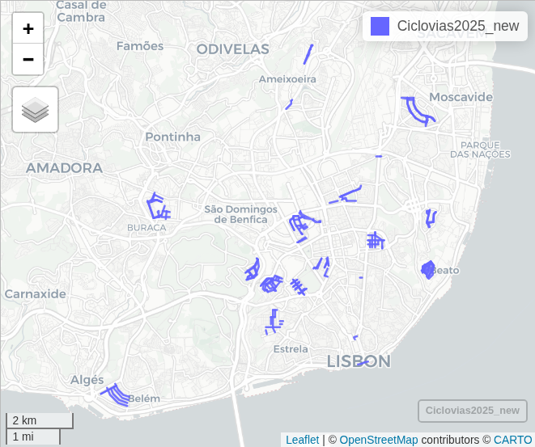
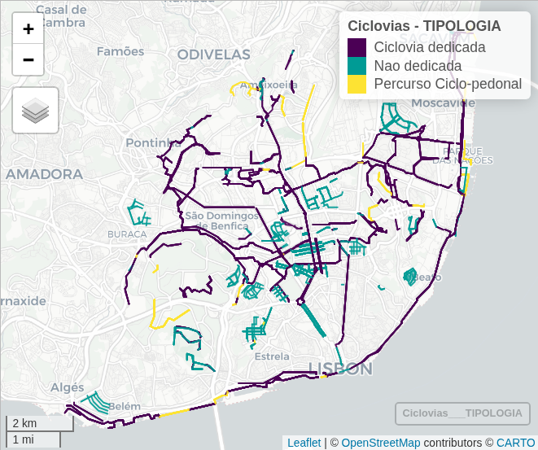
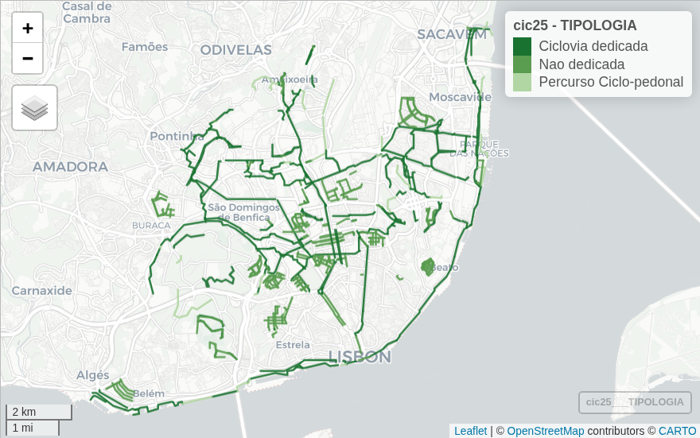

```{r setup, include=FALSE}
knitr::opts_chunk$set(echo = TRUE)
library(rmarkdown)
```

## Importação dos dados
#### Importar packages R
```{r eval=FALSE}
library(tidyverse)
library(sf)
library(mapview)
library(units)
library(cartography)
```

#### Importar rede ciclável
Download da informação geoffererenciada a partir do servidor da CML: 
https://services.arcgis.com/1dSrzEWVQn5kHHyK/arcgis/rest/services/Ciclovias/FeatureServer/0/query?outFields=*&where=1%3D1&f=geojson

```{r eval=FALSE}
CicloviasAnteriores = readRDS("CicloviasAnos/CicloviasAnos.Rds")
Ciclovias2025 = st_read("https://services.arcgis.com/1dSrzEWVQn5kHHyK/arcgis/rest/services/Ciclovias/FeatureServer/0/query?outFields=*&where=1%3D1&f=geojson")
```
```{r eval=FALSE}
length(unique(Ciclovias2025$OBJECTID)) #1069
length(unique(Ciclovias2025$COD_SIG)) #1041
```


## Corrigir dados

```{r eval=FALSE}
#filtrar só últimos anos
Ciclovias2025 = Ciclovias2025 %>% filter(ANO == "2025")

#exportar e abrir no sig
st_write(Ciclovias2025, "data/Ciclovias2025_dez_cml.gpkg", delete_dsn = TRUE)
```

#### Importar novamente o shp atualizado

```{r eval=FALSE}
Ciclovias2025_new = st_read("data/Ciclovias2025_corrigir.gpkg", layer = "ciclovias2025")
Ciclovias2025_new = Ciclovias2025_new |> filter(is.na(AnoT)) |> filter(ANO == 2025)
```

Neste caso adicionou-se:

* Álvaro Pais
* Avenida Santos Durmont
* Ponte Rotunda do Relógio
* Praça do Comércio (30 + bici)
* Av Glicínia Quartin (sta Clara)
* Bairro Madre de Deus (30 + bici)
* Rua Nossa Sra. Amparo (30 + bici)
* Bairro do Restelo (30 + bici)
* Continuação Av de Paris e bairro dos Actores (30 + bici)
* São Sebastião da Pedreira (30 + bici)
* Praça da Figueira
* Bairro Campolide (30 + bici)
* Campo de Ourique (30 + bici)
* Bairro da Serafina (30 + bici)
* R Marques da Silva troço (30 + bici)




#### Reclassificar ciclovias
Em __dedicadas__ (uni e bi-direccionais, pistas cicláveis) e __não-dedicadas__ (30+bici, zona de coexistência), e __percursos em coexistência com o peão__ (ciclo-pedonal)
```{r eval=FALSE}
table(Ciclovias2025_new$TIPOLOGIA)

Ciclovias2025_new = Ciclovias2025_new |> 
  mutate(TIPOLOGIA = case_when(
    TIPOLOGIA == "Percurso Ciclopedonal" ~ "Percurso Ciclo-pedonal",
    
    TIPOLOGIA %in% c(
      "Pista Ciclavel Bidirecional", 
      "Pista Ciclável Bidirecional", 
      "Pista Ciclável Unidirecional", 
      "Pista ciclável (ciclovia)", 
      "Contrassentido", 
      "Faixa Ciclável"
    ) ~ "Ciclovia dedicada",
    
    TIPOLOGIA %in% c("30+Bici", "Zona de Coexistência") ~ "Nao dedicada",
    
    TRUE ~ as.character(TIPOLOGIA) 
  ))

#factor tipologia
Ciclovias2025_new = Ciclovias2025_new |> mutate(TIPOLOGIA = factor(TIPOLOGIA))
table(Ciclovias2025_new$TIPOLOGIA)
```

#### Juntar novamente com as anteriores
```{r eval=FALSE}
#prolongar vida ultimos anos
CicloviasAnteriores_25 = CicloviasAnteriores %>% filter(AnoT == 2024) %>% mutate(AnoT = 2025)
CicloviasAnteriores = rbind(CicloviasAnteriores, CicloviasAnteriores_25)

#juntar, ignorando comprimento
Ciclovias = bind_rows(CicloviasAnteriores |> select(-lenght),
                      Ciclovias2025_new |> select(-lenght))

#remover duplicados
Ciclovias = distinct(Ciclovias)

# atribuir ID para ser mais fácil o corte e costura
Ciclovias = Ciclovias |> mutate(id = as.integer(row.names(Ciclovias)))
Ciclovias = Ciclovias |> mutate(AnoT = case_when(ANO == 2025 ~ 2025, TRUE ~ AnoT))


#recalcular geometria
Ciclovias$length = st_length(Ciclovias) %>% units::set_units(km)
sum(Ciclovias$length[Ciclovias$AnoT==2025]) #extensão da rede actual
# calma, há segmentos que foram destruídos entretanto
```


### Ver num mapa
Todas as ciclovias que existem ou existiram no server da CML
```{r eval=FALSE}
mapview::mapview(Ciclovias, zcol="TIPOLOGIA", lwd=1.5, hide=F, legend=T)
```


### Remover ciclovias que desapareceram entretanto


Atualizou-se a ciclovia da Av das Nações Unidas (cortada).
Marquês de Pombal passou a ter outra configuração em 2013.

#### Av Nações Unidas

```{r eval=FALSE}
Ciclovias_corrigir_trocos = st_read("data/Ciclovias2025_nacoesunidas.gpkg", layer="nacoesunidas")
Ciclovias_corrigir_trocos = Ciclovias_corrigir_trocos |> mutate(id = as.integer(row.names(Ciclovias_corrigir_trocos)))
#nacoesunidas - 1920 -> 2621 e 2622, era de 2019 e troço 2622 desaparece em 2025
#nacoesunidas - troço 3 desaparece em 2025
nacoes_id = 2334 # old
nacoes_novo_25 = Ciclovias_corrigir_trocos |> 
  filter(id %in% c(1,2)) |>
  mutate(AnoT = 2025,
         id = id + 9950) |> 
  select(-lenght)
nacoes_novo_25$length = st_length(nacoes_novo_25) %>% units::set_units(km)

Ciclovias = Ciclovias %>% filter(!(id %in% nacoes_id)) |> bind_rows(nacoes_novo_25)
```


### Marquês de Pombal

```{r}
Ciclovias_corrigir_trocos = st_read("data/Ciclovias2025_marques.gpkg", layer="marques")
marques_13 = Ciclovias_corrigir_trocos %>% mutate(AnoT = 2013, id = 99130+row_number())
marques_14 = Ciclovias_corrigir_trocos %>% mutate(AnoT = 2014, id = 99140+row_number())
marques_15 = Ciclovias_corrigir_trocos %>% mutate(AnoT = 2015, id = 99150+row_number())
marques_16 = Ciclovias_corrigir_trocos %>% mutate(AnoT = 2016, id = 99160+row_number())
marques_17 = Ciclovias_corrigir_trocos %>% mutate(AnoT = 2017, id = 99170+row_number())
marques_18 = Ciclovias_corrigir_trocos %>% mutate(AnoT = 2018, id = 99180+row_number())
marques_19 = Ciclovias_corrigir_trocos %>% mutate(AnoT = 2019, id = 99190+row_number())
marques_20 = Ciclovias_corrigir_trocos %>% mutate(AnoT = 2020, id = 99200+row_number())
marques_21 = Ciclovias_corrigir_trocos %>% mutate(AnoT = 2021, id = 99210+row_number())
marques_22 = Ciclovias_corrigir_trocos %>% mutate(AnoT = 2022, id = 99220+row_number())
marques_23 = Ciclovias_corrigir_trocos %>% mutate(AnoT = 2023, id = 99230+row_number())
marques_24 = Ciclovias_corrigir_trocos %>% mutate(AnoT = 2024, id = 99240+row_number())
marques_25 = Ciclovias_corrigir_trocos %>% mutate(AnoT = 2025, id = 99250+row_number())
marques = rbind(marques_13, marques_14, marques_15, marques_16, marques_17, marques_18, marques_19, marques_20, marques_21, marques_22, marques_23, marques_24, marques_25) |> 
  mutate(TIPOLOGIA = "Ciclovia dedicada")
marques$length = st_length(marques) %>% units::set_units(km)

marques_id = c(1327:1334, 1336, 1338, 1340, 1342, 2338, 2339)
Ciclovias = Ciclovias %>% filter(!(id %in% marques_id)) |> bind_rows(marques)
```


```{r eval=FALSE, include=FALSE}
rm(Ciclovias_corrigir_trocos, nacoes_novo_25, marques_13, marques_14, marques_15, marques_16, marques_17, marques_18, marques_19, marques_20, marques_21, marques_22, marques_23, marques_24, marques_25, marques)
```


### Confirmar mapa actual
```{r eval=FALSE}
cic25=Ciclovias[Ciclovias$AnoT==2025,]
# greens3 = cartography::carto.pal(pal1 = "green.pal", 3)
# greens3 = rev(greens3)
greens3 = c("#197230", "#5A9C50", "#B2D6A3")
mapview(cic25, zcol="TIPOLOGIA", color = greens3, lwd=2, hide=F, legend=T)
```


### Adicionar contador de km
```{r eval=FALSE}
# recalcular extensão
Ciclovias$length = st_length(Ciclovias) %>% units::set_units(km)

#Adicionar campo com extensão da rede acumulada
CicloviasKM = Ciclovias %>% select(AnoT, length, TIPOLOGIA) %>% st_drop_geometry()

CicloviasKMnull = data.frame(TIPOLOGIA= c("Nao dedicada", "Nao dedicada"),
                             length=0, AnoT = c(2001,2002),stringsAsFactors=FALSE)
CicloviasKMnull$length = CicloviasKMnull$length %>% units::set_units(km)
CicloviasKM = rbind(CicloviasKM,CicloviasKMnull)

CicloviasKM = CicloviasKM  %>% group_by(AnoT, TIPOLOGIA) %>% summarise(length = sum(length, na.rm=TRUE)) %>% ungroup()

CicloviasKM$Kms <- paste(round(CicloviasKM$length,digits = 0),"km", sep=" ")
```

### Agrupar features
Porque senão ficava muito lento
```{r eval=FALSE}
CicloviasAnos = Ciclovias %>% 
  group_by(DESIGNACAO,TIPOLOGIA,AnoT,ANO) %>% summarise() %>% ungroup()

CicloviasAnos$length = st_length(CicloviasAnos) %>% units::set_units(km)
sum(CicloviasAnos$length[CicloviasAnos$AnoT==2025]) #extensão da rede actual
```

## Guardar ficheiros
Na pasta da app
```{r eval=FALSE}
saveRDS(CicloviasAnos, "CicloviasAnos/CicloviasAnos.Rds")
saveRDS(CicloviasKM, "CicloviasAnos/CicloviasKM.Rds")
```

```{r}
st_write(Ciclovias |> select(-id), "data/Ciclovias_dez2025_CORRECT.gpkg", delete_dsn = TRUE)
st_write(Ciclovias, "data/Ciclovias_dez2025_CORRECT_id.gpkg", delete_dsn = TRUE)
saveRDS(Ciclovias, "data/Ciclovias_bk25.Rds")
```

```{r}
# Exportar rede separada por anos
for (i in unique(Ciclovias$AnoT)){
  CicloviasAno = Ciclovias %>% filter(AnoT == i)
  st_write(CicloviasAno, paste0("data/Ciclovias por ano/Ciclovias_",i,".gpkg"), delete_dsn = TRUE)
}
```

