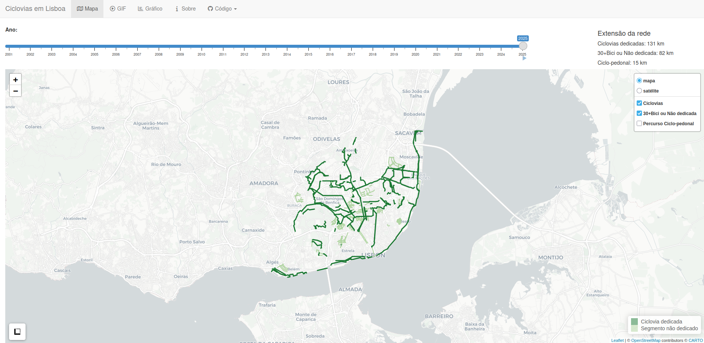
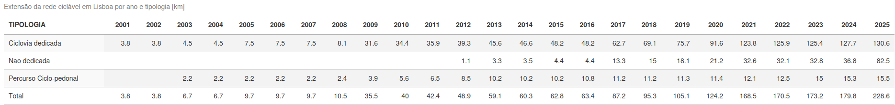

```{r setup, include=FALSE}
knitr::opts_chunk$set(echo = TRUE)
```

Mapa animado com a evolução da rede ciclável em Lisboa desde 2001 </br>

A informação base está disponível no site de geodados da CML: <https://geodados-cml.hub.arcgis.com/datasets/rede-cicl%C3%A1vel/>

### Este repositório contém três funções:

-   Processamento dos dados disponibilizados pela CML
-   GIF com evolução da rede ciclável em Lisboa, desde 2001 - [ir](https://github.com/U-Shift/RedeCiclavel-Lisboa#gif-com-evolução)
-   Mapa interactivo em html com slide para visualizar evolução longo dos anos - [ir](https://github.com/U-Shift/RedeCiclavel-Lisboa#mapa-interactivo-por-anos)

# Processamento dos dados

## Processo

O processo envolve limpeza, remoção de repetidos, reclassifiação de tipologia, tratamento especial de segmentos que foram alterados ao longo dos anos.

> Última atualização a 22.Março.2026

## GIF com evolução

[Ver código](https://github.com/U-Shift/RedeCiclavel-Lisboa/blob/master/GIFciclovias.Rmd), usando a informação processada aqui.\
Resultado em [RedeCiclavelLisboa2025.gif](https://server.ushift.pt/shiny/ciclovias/gif/RedeCiclavelLisboa2025.gif)


## Mapa interactivo por anos

[ver código](https://github.com/U-Shift/RedeCiclavel-Lisboa/blob/master/CicloviasAnos/app.R), usando a informação processada aqui.\
Resultado em [server.ushift.pt/shiny/ciclovias](https://server.ushift.pt/shiny/ciclovias)




