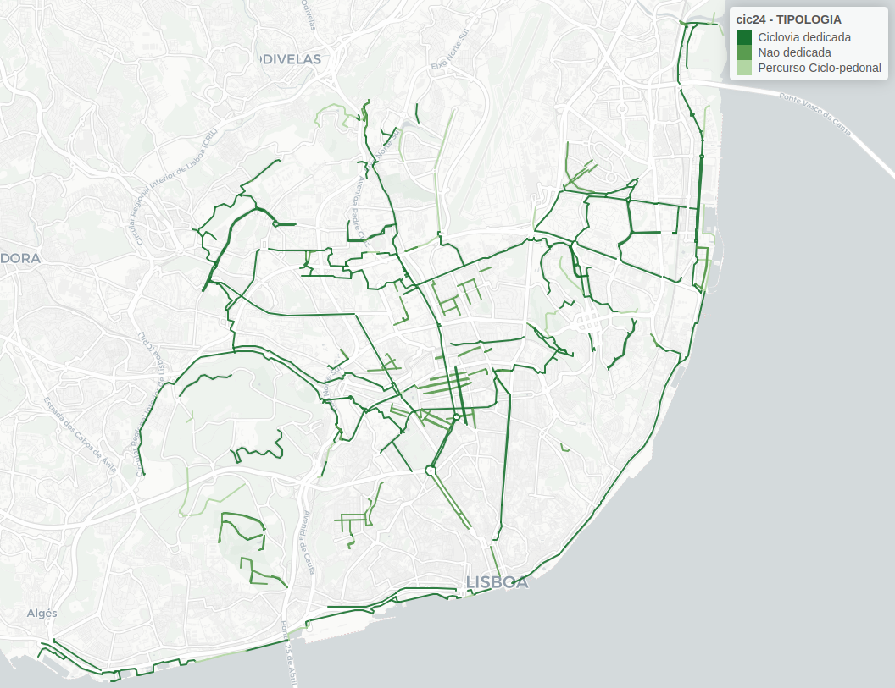
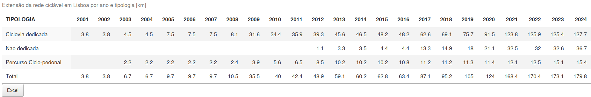

```{r setup, include=FALSE}
knitr::opts_chunk$set(echo = TRUE)
```

Mapa animado com a evolução da rede ciclável em Lisboa desde 2001 </br>

A informação base está disponível no site de geodados da CML: <https://geodados-cml.hub.arcgis.com/datasets/rede-cicl%C3%A1vel/>

### Este repositório contém três funções:

-   Processamento dos dados disponibilizados pela CML
-   GIF com evolução da rede ciclável em Lisboa, desde 2001 - [ir](https://github.com/U-Shift/RedeCiclavel-Lisboa#gif-com-evolução)
-   Mapa interactivo em html com slide para visualizar evolução longo dos anos - [ir](https://github.com/U-Shift/RedeCiclavel-Lisboa#mapa-interactivo-por-anos)

# Processamento dos dados

#### Importar rede ciclável

```{r eval=FALSE}
#actualizar para 2024 a partir do server da CML
CicloviasATUAL24 = sf::st_read("https://services.arcgis.com/1dSrzEWVQn5kHHyK/arcgis/rest/services/Ciclovias/FeatureServer/0/query?outFields=*&where=1%3D1&f=geojson") 
# infelixmente não têm os mesmos campos entre anos :(
```

#### Processo

O processo envolve limpeza, remoção de repetidos, reclassifiação de tipologia, tratamento especial de segmentos que foram alterados ao longo dos anos.

> Última atualização a 27.Janeiro.2025

## GIF com evolução

[Ver código](https://github.com/U-Shift/RedeCiclavel-Lisboa/blob/master/GIFciclovias.Rmd), usando a informação processada aqui.\
Resultado em [RedeCiclavelLisboa2024.gif](https://ushift.rosafelix.bike/shiny/ciclovias/gif/RedeCiclavelLisboa2024.gif)



## Mapa interactivo por anos

[ver código](https://github.com/U-Shift/RedeCiclavel-Lisboa/blob/master/CicloviasAnos/app.R), usando a informação processada aqui.\
Resultado em [ushift.rosafelix.bike/shiny/ciclovias](https://ushift.rosafelix.bike/shiny/ciclovias)

](images/clipboard-2333512650.png)


