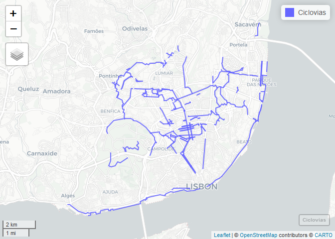
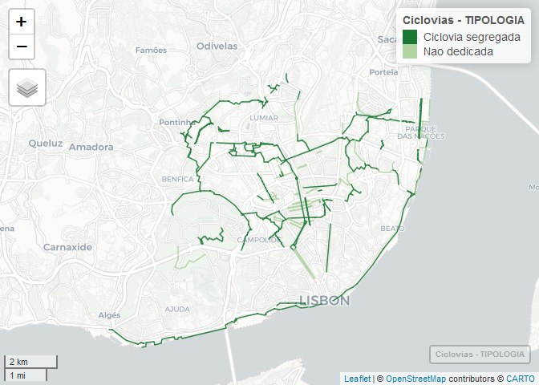

Rede Ciclável Liboa - Mapa animado
================

Mapa animado com a evolução da rede ciclável em Lisboa desde 2001 </br> A informação base está disponível no site de geodados da CML: <http://geodados.cm-lisboa.pt/datasets/440b7424a6284e0b9bf11179b95bf8d1_0>

Este repositório contém duas funções:
-------------------------------------

-   GIF com evolução da rede ciclável em Lisboa, desde 20201
-   Mapa interactivo em html com slide para visualizar ao longo dos anos: <shiny.desv.io/ciclovias>

GIF interactivo
===============

Importação dos dados
--------------------

#### Importar packages

``` r
library(tidyverse)
library(sf)
library(mapview)
library(units)
library(cartography)
```

#### Importar shapefiles Lisboa

``` r
#Limites de Lisboa
LisboaLimite <-st_read("data/Lisboa_limite.gpkg")
LisboaLimite = LisboaLimite[,c(3,5)] %>% st_transform(LisboaLimite,  crs = 4326)
```

#### Importar rede ciclável

``` r
#actualizar para 2020 a partir do server da CML
CicloviasATUAL = st_read("https://opendata.arcgis.com/datasets/440b7424a6284e0b9bf11179b95bf8d1_0.geojson") 
```

    ## Reading layer `Ciclovias' from data source `https://opendata.arcgis.com/datasets/440b7424a6284e0b9bf11179b95bf8d1_0.geojson' using driver `GeoJSON'
    ## Simple feature collection with 684 features and 28 fields
    ## geometry type:  LINESTRING
    ## dimension:      XY
    ## bbox:           xmin: -9.228815 ymin: 38.69188 xmax: -9.090616 ymax: 38.7956
    ## geographic CRS: WGS 84

``` r
#st_write(CicloviasATUAL[,c(4,7,19)], "data/Ciclovias072020.shp") #data deste mês
```

Alterei alguns segmentos no QGIS, principalmente anos que não estão correctos na BD oficial.

``` r
#voltar a importar
Ciclovias <-st_read("data/Ciclovias2020Julho.gpkg")
```

    ## Reading layer `Ciclovias2020Julho' from data source `D:\GIS\Ciclovias_CML\RedeCiclavel-Lisboa\data\Ciclovias2020Julho.gpkg' using driver `GPKG'
    ## Simple feature collection with 199 features and 3 fields
    ## geometry type:  MULTILINESTRING
    ## dimension:      XY
    ## bbox:           xmin: -9.228815 ymin: 38.69188 xmax: -9.091449 ymax: 38.79549
    ## geographic CRS: WGS 84

##### Acertar geometria

``` r
#recalcular geometria
Ciclovias$lenght = st_length(Ciclovias) %>% units::set_units(km)
sum(Ciclovias$lenght)
```

    ## 119.9682 [km]

``` r
# calma, há segmentos que foram destruídos entretanto
```

### Ver num mapa

Todas as ciclovias que existiram

``` r
Ciclovias = Ciclovias %>% arrange(Ano)
mapview::mapview(Ciclovias)
```



Processar dados
---------------

### Reclassificar ciclovias

Em *segregadas* (uni e bi-direccionais) e *banalizadas* (30+bici, zona de coexistência)

``` r
Ciclovias$TIPOLOGIA = as.character(Ciclovias$TIPOLOGIA)
table(Ciclovias$TIPOLOGIA)
```

    ## 
    ##                      30+Bici                     Bus+Bici 
    ##                           52                            1 
    ##           Ciclovia segregada               Faixa Ciclavel 
    ##                           48                            1 
    ##  Faixa Ciclavel (Contraflow)  Pista Ciclavel Bidirecional 
    ##                            1                           72 
    ## Pista Ciclavel Unidirecional                        Ponte 
    ##                            6                            1 
    ##         Zona de Coexistencia 
    ##                           17

``` r
Ciclovias$TIPOLOGIA[Ciclovias$TIPOLOGIA=="Faixa Ciclavel (Contraflow)"] = "Ciclovia segregada"
Ciclovias$TIPOLOGIA[Ciclovias$TIPOLOGIA=="Faixa Ciclavel"] = "Ciclovia segregada"
Ciclovias$TIPOLOGIA[Ciclovias$TIPOLOGIA=="Pista Ciclavel Bidirecional"] = "Ciclovia segregada"
Ciclovias$TIPOLOGIA[Ciclovias$TIPOLOGIA=="Pista Ciclavel Unidirecional"] = "Ciclovia segregada"
Ciclovias$TIPOLOGIA[Ciclovias$TIPOLOGIA=="Ponte"] = "Ciclovia segregada"
Ciclovias$TIPOLOGIA[Ciclovias$TIPOLOGIA=="Zona de Coexistencia"] = "Nao dedicada"
Ciclovias$TIPOLOGIA[Ciclovias$TIPOLOGIA=="Bus+Bici"] = "Nao dedicada"
Ciclovias$TIPOLOGIA[Ciclovias$TIPOLOGIA=="30+Bici"] = "Nao dedicada"
table(Ciclovias$TIPOLOGIA)
```

    ## 
    ## Ciclovia segregada       Nao dedicada 
    ##                129                 70

#### Ver num mapa

``` r
greens = cartography::carto.pal(pal1 = "green.pal", 2)
greens = rev(greens)
mapview(Ciclovias, zcol="TIPOLOGIA", color = greens, lwd=1.5, hide=T, legend=T)
```



### Criar tabelas para cada ano

``` r
Ciclovias$Ano = as.integer(Ciclovias$Ano)
Ciclovias$AnoT = Ciclovias$Ano
Cic01 = Ciclovias %>% subset(AnoT==2001)
Cic02 = Cic01
Cic02$AnoT = 2002 #não se passou nada
Cic03 = Ciclovias %>% subset(AnoT==2003) %>% rbind(Cic02) %>% arrange(Ano)
Cic03$AnoT = 2003
Cic03 = Cic03[-c(4,5),] #remover corte do campo grande: construção do estádio Alvalade em 2003/2004
Cic04 = Cic03
Cic04$AnoT = 2004
Cic05 = Ciclovias %>% subset(AnoT==2005) %>% rbind(Cic04) %>% arrange(Ano)
Cic05$AnoT = 2005
Cic06= Cic05
Cic06$AnoT = 2006
Cic07 = Cic06
Cic07$AnoT = 2007
Cic08 = Ciclovias %>% subset(AnoT==2008) %>% rbind(Cic07) %>% arrange(Ano)
Cic08$AnoT = 2008
Cic09 = Ciclovias %>% subset(AnoT==2009) %>% rbind(Cic08) %>% arrange(Ano)
Cic09$AnoT = 2009
Cic10 = Ciclovias %>% subset(AnoT==2010) %>% rbind(Cic09) %>% arrange(Ano)
Cic10$AnoT = 2010
Cic11 = Ciclovias %>% subset(AnoT==2011) %>% rbind(Cic10) %>% arrange(Ano)
Cic11$AnoT = 2011
Cic12 = Ciclovias %>% subset(AnoT==2012) %>% rbind(Cic11) %>% arrange(Ano)
Cic12$AnoT = 2012
Cic13 = Ciclovias %>% subset(AnoT==2013) %>% rbind(Cic12) %>% arrange(Ano)
Cic13$AnoT = 2013
Cic13 = Cic13[-c(66),] #substituiçao do bici+BUS da avenida da liberdade pelas laterais
Cic14 = Ciclovias %>% subset(AnoT==2014) %>% rbind(Cic13) %>% arrange(Ano)
Cic14$AnoT = 2014
Cic15 = Cic14 #nada de novo
Cic15$AnoT = 2015
Cic16 = Ciclovias %>% subset(AnoT==2016) %>% rbind(Cic15) %>% arrange(Ano)
Cic16$AnoT = 2016
Cic17 = Ciclovias %>% subset(AnoT==2017) %>% rbind(Cic16) %>% arrange(Ano)
Cic17$AnoT = 2017
Cic18 = Ciclovias %>% subset(AnoT==2018) %>% rbind(Cic17) %>% arrange(Ano)
Cic18$AnoT = 2018
Cic18 = Cic18[-c(27,152),] #desaparece a zona coexist junto ao rio no braço de prata, e é criada uma ciclovia. é reformulada uma ciclovia na estrada da pontinha
Cic19 = Ciclovias %>% subset(AnoT==2019) %>% rbind(Cic18) %>% arrange(Ano)
Cic19$AnoT = 2019
Cic20 = Ciclovias %>% subset(AnoT==2020) %>% rbind(Cic19) %>% arrange(Ano)
Cic20$AnoT = 2020
sum(Cic20$lenght)
```

    ## 115.3707 [km]

``` r
#melhorar isto para uma função, remover as ciclovias depois em todos os anos dali para a frente
```

``` r
#Todos em que houve alteração
Ciclovias2020<- rbind(Cic01,Cic03,Cic05,Cic08,Cic09,Cic10,Cic11,Cic12,Cic13,Cic14,Cic16,Cic17,Cic18, Cic19, Cic20)
#Adicionar anos nulos
Ciclovias2020T<- rbind(Cic01,Cic02,Cic03,Cic04,Cic05,Cic06,Cic07,Cic08,Cic09,Cic10,Cic11,Cic12,Cic13,Cic14,Cic15,Cic16,Cic17,Cic18,Cic19,Cic20) #Tabela final

#remover o que não interessa
rm(Cic01,Cic02,Cic03,Cic04,Cic05,Cic06,Cic07,Cic08,Cic09,Cic10,
   Cic11,Cic12,Cic13,Cic14,Cic15,Cic16,Cic17,Cic18,Cic19,Cic20) 
```

### Adicionar contador de km

``` r
#Adicionar campo com extensão da rede acumulada
CicloviasKM = Ciclovias2020T[,c(2,4)]
st_geometry(CicloviasKM) = NULL
CicloviasKM = CicloviasKM  %>% group_by(AnoT) %>% summarise_at(1, sum, na.rm=TRUE)

#CicloviasKM$Km <- round(CicloviasKM$lenght,digits = 0)
#CicloviasKM$Kmkm <- "km"
CicloviasKM$Kms <- paste(CicloviasKM$Km,"km", sep=" ")
```

    ## Warning: Unknown or uninitialised column: 'Km'.

### Juntar cada ano numa só feature

Porque senão ficava muito lento

``` r
CicloviasAnos = Ciclovias2020T %>% group_by(AnoT) %>% summarise_at(2, sum, na.rm=TRUE) %>% st_union(by_feature=T)
```

Processar as imagens para o gif
-------------------------------

#### criar elementos vazios nos anos em que nao aconteceu nada

``` r
vazios <-data.frame(TIPOLOGIA = as.character(NA),
                   lenght = 0,
                   Ano = as.integer(c(2002,2004,2006,2007,2015)))
vazios$AnoT <-vazios$Ano
vazios$geom<-st_sfc(st_multilinestring())
vazios<-st_sf(vazios, crs=4326)
vazios$lenght = units::set_units(vazios$lenght, km)
CicloviasGif = rbind(Ciclovias, vazios)
```

### Criar os GIF

``` r
listaAnos = seq(1:5)+2000

RedeCiclavelLxkm <- function(Year){
  ggplot()+
    geom_sf(data=LisboaLimite,aes(),color = NA) +
    geom_sf(data=subset(CicloviasAnos,AnoT==Year),
            aes(fill =AnoT),color="grey70",size=1,alpha=0.2,show.legend=F) +
    geom_sf(data=subset(CicloviasGif,Ano==Year),aes(),
            color="black",size=1.1,alpha=0.2,show.legend=F) +
    geom_text(data=subset(CicloviasKM,AnoT==Year),
              aes(x=-84000,y=-107000,label=Kms), size=6,inherit.aes=FALSE) +
   facet_wrap(~AnoT, nrow=1)+
    mapTheme()
  
  ggsave(filename=paste0("gif/",Year,"km.png"),
         units="cm",width=20, height=18, dpi=600)
}

# listaAnos %>% map_df(RedeCiclavelLxkm)
# Error in unit(x, default.units) : 'x' and 'units' must have length > 0
```

Note that the `echo = FALSE` parameter was added to the code chunk to prevent printing of the R code that generated the plot.
